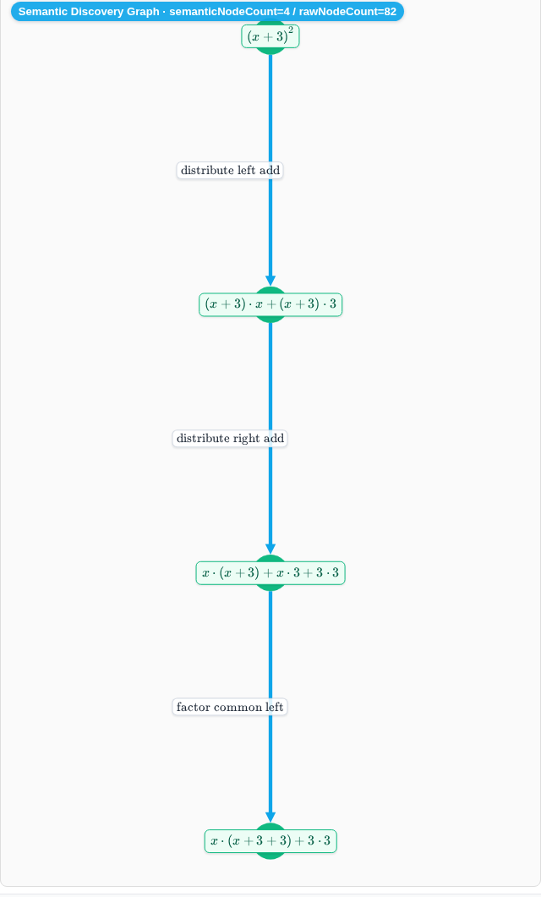
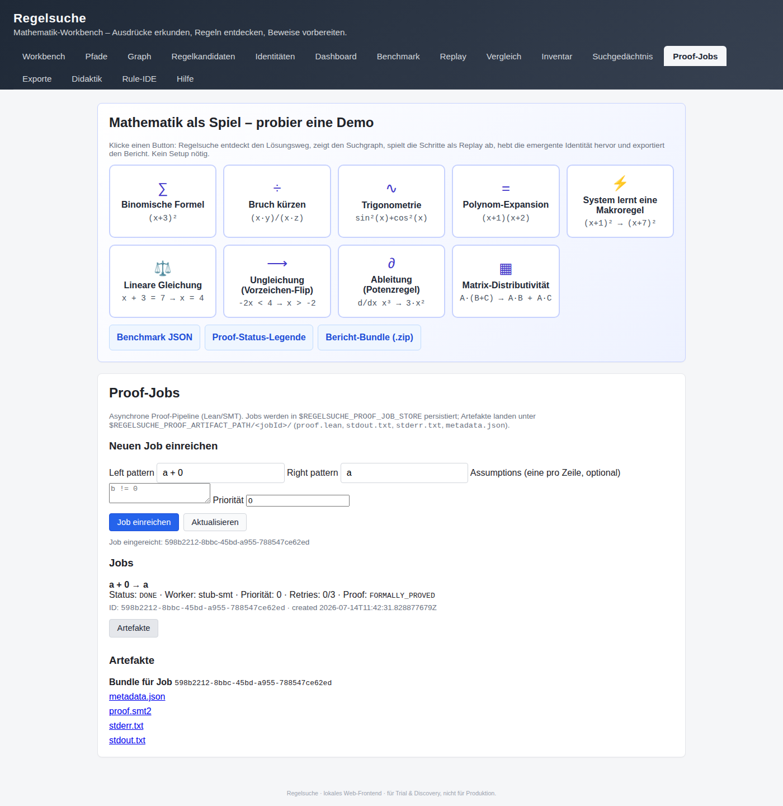

# Regelsuche

[](https://github.com/carstenartur/Regelsuche/actions/workflows/gradle.yml)
[](https://github.com/carstenartur/Regelsuche/actions/workflows/docker-image.yml)
[](https://github.com/carstenartur/Regelsuche/actions/workflows/ci-cd.yml)
[](https://carstenartur.github.io/Regelsuche/coverage/)
[](https://carstenartur.github.io/Regelsuche/tests/)
[](https://github.com/carstenartur/Regelsuche/actions/workflows/benchmark.yml)
[](https://github.com/carstenartur/Regelsuche/actions/workflows/release.yml)
[](LICENSE)
[](https://github.com/carstenartur/Regelsuche/dependency-graph/sbom)
[](https://github.com/carstenartur/Regelsuche/releases)

📊 **[Coverage report](https://carstenartur.github.io/Regelsuche/coverage/)** ·
📋 **[Test report](https://carstenartur.github.io/Regelsuche/tests/)** ·
⚡ **[Performance charts](https://carstenartur.github.io/Regelsuche/dev/bench/)**

> **Regelsuche macht mathematische Umformungsräume sichtbar.**
> Knoten sind Ausdrücke, Kanten sind Umformungen, Pfade sind Rechenwege —
> mit Replay, Proof-Bridge und einem klickbaren Web-Workbench.



## 30 Sekunden (Demo Standard)

**Der Standardmodus der Demo läuft ohne externe Infrastruktur:**

```bash
docker build -t regelsuche .
docker run --rm -p 8080:8080 regelsuche
```

[http://localhost:8080/](http://localhost:8080/) öffnen, einen der neun
Demo-Buttons klicken — Binomische Formel, Bruchkürzung, Trigonometrie,
Polynom-Expansion, Macro-Learning, Gleichung, Ungleichung, Ableitung,
Matrix. Die Suche läuft, der Suchgraph erscheint, der Replay läuft Schritt
für Schritt durch den Lösungsweg, der Bericht steht als ZIP bereit.

Eine kuratierte Übersicht **mit echten, aus den Tests generierten
Screenshots** zu jeder Demo:
👉 **[docs/demo-gallery.md](docs/demo-gallery.md)**.

## Optional: Full Mode mit PostgreSQL/Hibernate

Für persistente, größere Analysen mit PostgreSQL, Hibernate ORM und Hibernate
Search gibt es eine optionale `docker-compose.yml` — sie ist **nur optionaler
Persistenz-/Full-Mode** und nicht Voraussetzung für die Quickstart-Demo:

```bash
docker compose up --build
```

Das startet App + PostgreSQL + persistentes Volume und setzt `POSTGRES_URL`,
`POSTGRES_USER`, `POSTGRES_PASSWORD` automatisch. Neo4j bleibt optional für
mathematische Graph-Provenance (`docker compose --profile neo4j up --build`).
Details in
[`docs/getting-started.md`](docs/getting-started.md) und
[`docs/persistence.md`](docs/persistence.md).

## 5-Minuten-Tour

Eine knappe, geführte Tour für neue Nutzer (≈ 5 Minuten):

1. **Demo starten.** Auf `http://localhost:8080/` einen Demo-Button (z.B.
   _Binomische Formel_) klicken. Erst nach diesem Klick werden die Folge-Tabs
   (Graph, Replay, Proof-Jobs, Export, …) sichtbar — das Landing-Form ist
   absichtlich auf einen einzigen Hauptfluss „Ausdruck → Ziel → Suche starten"
   reduziert.
2. **Suchgraph + Replay ansehen.** `Graph`-Tab zeigt den entdeckten
   Transformationsraum; `Replay` spielt den besten Pfad Schritt für Schritt
   ab.
3. **Proof-Job anlegen.** Im `Proof-Jobs`-Tab `Left=a + 0`, `Right=a`
   eintippen und _Job einreichen_ klicken — der Status der asynchronen
   Pipeline wird live aktualisiert, Artefakte (`proof.smt2`, `proof.lean`,
   `metadata.json`, `stdout.txt`, `stderr.txt`) liegen unter
   `$REGELSUCHE_PROOF_ARTIFACT_PATH/<jobId>/`.
   
4. **Qualitätsdashboard prüfen.** `Benchmark`-Tab → jede Zeile zeigt
   Ampelstatus, `expectedResultMatched`, e-Graph-Größe, Saturation-Sparung
   und ob eine gelernte Makroregel beteiligt war. Der vollständige Report
   liegt unter [`docs/benchmark-report.md`](docs/benchmark-report.md) (CI lädt
   ihn als Artefakt `benchmark-report` hoch).
5. **Bericht exportieren.** Im `Exporte`-Tab den `bundle.zip` Download
   starten — enthält Markdown/LaTeX/JSON/Mermaid/GraphML und das aktuelle
   Rule-Inventory.

## Was kann Regelsuche?

* **Atomare Rewrite-Regeln** statt vorgefertigter Formeln — Schulbuchidentitäten
  emergieren als Pfade durch den Suchraum.
* **Vier Math-Domänen** mit eigenen Replay-Karten: Gleichungen,
  Ungleichungen (inkl. Vergleichszeichen-Flip), Analysis
  (Potenz-/Summen-/Produktregel), Lineare Algebra (`bmatrix`-Preview).
* **Suchstrategien**: Best-First, Beam, A\*, Random-Monte-Carlo,
  **Equality Saturation** mit eigenem E-Graph.
* **Discovery+** — domain-aware Mining: gefundene Makroregeln werden
  automatisch mit `equations`, `inequalities`, `calculus` oder
  `linear-algebra` getaggt.
* **Proof-Bridge** generiert ein Lean/SMT-Skript pro Pfad. `FORMALLY_PROVED`
  wird nur gesetzt, wenn der Prover den Beweis bestätigt.
* **Proof-Workbench** — persistente Job-Queue mit REST-API
  (`POST /api/proof/jobs`, `GET /api/proof/jobs/{id}`,
  `POST /api/proof/jobs/{id}/cancel`,
  `GET /api/proof/jobs/{id}/artifacts`) plus eigener UI-Tab. Jobs, Cache und
  Artefakt-Bundle (`proof.lean`, `proof.smt2`, `stdout.txt`, `stderr.txt`,
  `metadata.json` pro Job) werden via `REGELSUCHE_PROOF_ENABLED`,
  `REGELSUCHE_PROOF_ARTIFACT_PATH`, `REGELSUCHE_PROOF_JOB_STORE` und
  `REGELSUCHE_PROOF_CACHE` konfiguriert. Für echte Prover gibt es
  `Dockerfile.proof` (Z3 + cvc5 vorinstalliert, Lean optional via
  `--build-arg INSTALL_LEAN=true`).
* **Persistenz** als leichter JSON-Demo-Modus, PostgreSQL/Hibernate-Metadaten
  im Full Mode, Hibernate Search für Text/Facetten und optionales Neo4j für
  mathematische Graph-Provenance.
* **Export-Bundle** mit Markdown, LaTeX, JSON, Mermaid, GraphML und dem
  Rule-Inventory in einer einzigen ZIP.

## Quickstart-Varianten

* [Getting Started](docs/getting-started.md) — Docker, lokaler Gradle-Lauf,
  wichtige Endpunkte, optionaler Neo4j-Mode.
* [Architektur](docs/architecture.md) — Leitplanken und Überblick.
* [Modulstruktur](docs/module-structure.md) — Gradle-Module inkl. Search/Persistence/Learning/Experiments (inkl. Seed-Corpus)/CLI/Discovery, verbleibende logische Module und Paketmapping.
* [Dependency-Regeln](docs/dependency-rules.md) — erlaubte Abhängigkeitsrichtungen.
* [Nutzer-Workflows](docs/user-workflows.md) — Lehrer/Schüler,
  Forscher, CAS-Vergleich, Proof-Workflow.
* [Such-Intelligenz](docs/search-intelligence.md) und
  [Equality-Saturation](docs/equality-saturation.md).
* [Math-Domains](docs/math-domains.md) — semantische Domänen, Replay-Karten,
  Discovery-Tags.
* [Discovery Engine](docs/discovery-engine.md) — End-to-End-Pipeline von Seed
  über Replay bis Persistenz/Reports.
* [Hypothesis Mining](docs/hypothesis-mining.md) — Kandidaten, Annahmen,
  Counterexamples, Promotion.
* [Experiment Runner](docs/experiment-runner.md) — deterministische
  Seed-Auswertung, Budgets, Parallelität.
* [Replay & Reports](docs/replay-and-reports.md) — Replay-UX, Discovery-Report-
  Artefakte, Browser-Screenshots/GIFs.
* [Storage Architecture](docs/storage-architecture.md) — In-Memory, JSON,
  PostgreSQL/Hibernate und Artefakt-Ablage.
* [Mathematical Algorithms](docs/mathematical-algorithms.md) — Registry,
  Validierungs-Backends und aktuelle Toggles.
* [Scientific Reproducibility](docs/scientific-reproducibility.md) —
  reproduzierbare Discovery-Läufe, Seeds und CI-Artefakte.
* [Proof-Bridge](docs/proof-bridge.md) — vom Pfad zum formalen Beweis.
* [Proof-Workbench](docs/proof-workbench.md) — persistente Jobs, REST,
  Artefakt-Bundle, Dockerfile.proof.
* [Macro-Rules](docs/macro-rules.md) — wie das System eigene Regeln lernt.
* [Testing](docs/testing.md) — Task-Referenz der Testpipelines.
* [Testing-Strategie](docs/testing-strategy.md) — Schichtung nach Core/Integration/E2E.
* [Developer Guide](docs/developer-guide.md) — Repo-Layout, Build-Kommandos,
  Konventionen, neue Endpunkte hinzufügen.

Eine Komplett-Übersicht der Dokumentation findet sich unter
[`docs/`](docs/). Die historische Langfassung dieses README ist
nach [`docs/README.legacy.md`](docs/README.legacy.md) verschoben und
bleibt für Detail-Recherchen erhalten.

## Mitmachen

Pull Requests sind willkommen — bitte beachte:

* `./gradlew test` muss grün sein,
* `./gradlew e2eTest` muss grün sein, sobald UI-Code geändert wurde
  (siehe [docs/testing.md](docs/testing.md)),
* Screenshots in [docs/demo-gallery.md](docs/demo-gallery.md) werden
  ausschließlich über `./gradlew e2eTest -Pregelsuche.recordDocs=true`
  aktualisiert — niemals händisch ersetzen.
* Nutzerseitige Texte (Demo-Gallery, UI, Replay-Karten, Berichte)
  bitte gegen die
  [Documentation Quality Checklist](docs/documentation-quality-checklist.md)
  prüfen.

Lizenz: [MIT](LICENSE).
