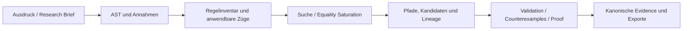

# Regelsuche

[](https://github.com/carstenartur/Regelsuche/actions/workflows/gradle.yml)
[](https://carstenartur.github.io/Regelsuche/coverage/)
[](https://carstenartur.github.io/Regelsuche/tests/)
[](https://carstenartur.github.io/Regelsuche/dev/bench/)
[](https://github.com/carstenartur/Regelsuche/dependency-graph/sbom)
[](LICENSE)
[](https://doi.org/10.5281/zenodo.20951900)

**Regelsuche ist eine reproduzierbare Plattform zur Suche, Erklärung und
Untersuchung symbolischer mathematischer Umformungen.** Mathematische Ausdrücke
werden als AST-Zustände modelliert, Regeln als ausführbare Züge und Rechenwege
als nachvollziehbare Pfade durch einen Suchraum.

Die Plattform verbindet eine grafische Workbench, mehrere Suchverfahren,
deklarative und programmatische Regeln, Discovery- und Lernverfahren,
Validierungs- und Proof-Backends sowie hashgebundene Forschungsartefakte.

[Demo starten](#schnellstart) ·
[Dokumentation](docs/README.md) ·
[Aktueller Forschungsstand](docs/discovery-status.md) ·
[Architektur](docs/architecture.md) ·
[Polynomfaktorisierung](docs/domain-aware-polynomial-factorization.md) ·
[Unabhängige Reproduktion](docs/independent-reproduction.md)

> Regelsuche ist weder ein allgemeiner Ersatz für ein Computer-Algebra-System
> noch ein Automatismus für mathematische Neuheit. Sucherfolg, Validierung,
> formaler Beweis, Projekt-Neuheit, externe Neuheit und Veröffentlichung sind
> getrennte, fehlersicher sperrende Evidenzstufen.

## Schnellstart

Die **Standarddemo läuft ohne externe Infrastruktur**. Sie benötigt weder eine
Datenbank noch einen externen Solver und wird ausschließlich lokal veröffentlicht:

```bash
docker build -t regelsuche .
docker run --rm -p 127.0.0.1:8080:8080 regelsuche
```

Danach `http://127.0.0.1:8080/` öffnen und eine der geführten Demos starten.
Suchgraph, gefundene Pfade, Replay, AST-Regelradar, Proof-Jobs und Exporte sind
in derselben Workbench erreichbar.

Die ungebundene Variante `docker run --rm -p 8080:8080 regelsuche` veröffentlicht
die Demo auf allen Host-Interfaces. Sie ist für die lokale Standarddemo nicht
empfohlen und nur in bewusst isolierten Umgebungen sinnvoll.

Ohne Docker genügt mit JDK 25:

```bash
./gradlew run
```

Der vollständige Einstieg einschließlich Sicherheitshinweisen und
Fehlerdiagnose steht in [Getting Started](docs/getting-started.md).

## Optional: Full Mode

Docker Compose ist **nur optional** und **keine Voraussetzung** für die
Standarddemo. Der Full Mode ergänzt PostgreSQL, Hibernate ORM/Search,
persistente Volumes und optional Neo4j-Provenienz:

```bash
docker compose up --build
```

Das optionale Neo4j-Profil startet mit:

```bash
docker compose --profile neo4j up --build
```

Details und Produktionsgrenzen stehen in [Persistenz und Full Mode](docs/persistence.md).

## Mathematik als Spiel

Das Projekt folgt einem einfachen Modell:

- ein mathematischer Ausdruck ist eine **Position**;
- eine anwendbare Transformationsregel ist ein **legaler Zug**;
- eine Folge von Transformationen ist eine **Spielvariante** beziehungsweise
  ein Rechenweg;
- ein Suchverfahren untersucht mögliche Varianten unter expliziten Budgets;
- wiederkehrende erfolgreiche Varianten können zu höheren Strategien werden.

Der mathematische Raum ist im Gegensatz zu einem Brettspiel nicht endlich.
Regelsuche enumeriert deshalb nicht Ausdrücke naiv, sondern erkennt
parametrisierte Muster in abstrakten Syntaxbäumen. Eine endliche Regel kann so
für unendlich viele konkrete Ausdrücke stehen.

## Was sich mit Regelsuche untersuchen lässt

- **Transformationsräume durchsuchen:** Best-First, Beam, `A*`, Monte Carlo und
  Equality Saturation arbeiten auf denselben expliziten Zuständen und Kanten.
- **Rechenwege erklären:** Jeder retained Pfad enthält Regelherkunft,
  AST-Position, Bindungen, Annahmen und Kosten.
- **Lokale Regelanwendungen prüfen:** Das AST-Regelradar zeigt, welche konkrete
  Regel an welcher Baumposition anwendbar ist und welchen vollständigen
  Folgeausdruck sie erzeugt.
- **Regeln und Strategien erweitern:** Java-Plugins, Regeldateien, Knowledge
  Packs, deklarative Makros und qualifizierte gelernte Makros besitzen getrennte
  Vertrauens- und Aktivierungsgrenzen.
- **Kandidaten bilden und falsifizieren:** Targetfreie Suchbeobachtungen können
  zu parametrisierten Hypothesen verdichtet und gegen Holdouts sowie
  Counterexamples geprüft werden.
- **Gelernte Regeln generationenweise prüfen und wiederverwenden:** Akzeptierte
  experimentelle Regeln werden erst nach Abschluss einer Generation in ein
  eingefrorenes Schatteninventar der nächsten Generation übernommen. Gleichzeitiges
  Lernen und Nutzen innerhalb derselben Generation ist ausgeschlossen.
- **Mathematische Darstellungen und Faktorisierungen synthetisieren:** Exakte
  semantische Views erzeugen kanonische Polynome in expliziten Ringen. Engines
  liefern zunächst untrusted Vorschläge; erst unabhängige Vertrags- und
  Produktprüfung autorisiert eine Suchkante.
- **Beweisobligationen erzeugen:** Proof-Backends erhalten versionierte
  Obligationen. Ein formaler Status wird nur aus tatsächlich bestätigter
  Proof-Evidence abgeleitet.
- **Ergebnisse reproduzieren:** Kanonische JSON-Artefakte, Manifeste, Hashes,
  Containerläufe und unabhängige Verifier machen Konfiguration und Ergebnis
  überprüfbar.

## Regelgerichtete Vorbereitung fast passender Ausdrücke

Eine Regel wird nicht mehr allein deshalb verworfen, weil ihr linkes Muster den
aktuellen AST nicht unmittelbar trifft. Der produktnahe Unified Coordinator
verwendet folgende Reihenfolge:

```text
konkrete direkte Regelanwendung
  -> typisierte Guard-Prüfung
  -> registrierter nativer Exact-Spezialist
  -> begrenzte, mustergerichtete lokale Bridge-Suche
  -> erneute konkrete Regelanwendung
  -> unabhängige Verifikation
```

Direkte Ausführung bleibt der billigste und maßgebliche Pfad. Erst danach darf
eine explizite `RewriteApplicabilitySchema` die Vorbereitung lenken. Das Schema
enthält kein gewünschtes Ergebnis und keinen deklarativen Ersatz für eine
algorithmische Java-Regel.

Die content-addressed `SafePreparationEngineRegistry` bindet die vorhandenen
exakten Spezialsolver für Polynomquotienten, AC-Faktorexposition, gemeinsame
Monomfaktoren, perfekte Quadrate und gemeinsame Nenner an eine feste Reihenfolge
und an ihre jeweilige native Hauptregel. Ein nur ähnlich aussehendes importiertes
oder gelerntes Pattern erbt nicht automatisch den Solververtrag einer anderen
Regel.

Wo kein nativer Spezialist zuständig ist, untersucht der bounded local bridge
ein eingefrorenes Inventar äquivalenzbewahrender Vorbereitungen. Jede positive
Anwendung muss am retained End-AST nochmals durch den wirklichen Executor
abgespielt werden. Die Evidence behält insbesondere:

- Ausgangs-, Zwischen- und Ergebnis-AST;
- Regel-, Schema-, Registry- und Inventar-Fingerprints;
- partielle Bindungen und Restbedingungen;
- typisierte Voraussetzungen und kumulierte Annahmen;
- vollständige primitive Regellinie;
- Work Accounting und erreichte Grenzen;
- ein unabhängig erneut prüfbares Zertifikat.

Unbekannte Voraussetzungen autorisieren keinen Zug. Beispielsweise wird die
Teleskopidentität für `1/(n*(n+1))` nur unter den gebundenen Bedingungen
`n != 0` und `n + 1 != 0` ausgeführt. Technische Exceptions werden als
`TECHNICAL_FAILURE` retained und nicht als gewöhnlicher Nichttreffer behandelt.

Eine exakt promovierte gelernte Pattern-Regel kann denselben lokalen
Vorbereitungspfad nutzen. Der erste implementierte Promotionsadapter akzeptiert
nur assumption-free Identitäten in einem begrenzten exakten Polynomfragment.
Rohe evolutionär erzeugte Regeln bleiben dagegen bewusst
`isEquivalencePreservingByConstruction() == false`. Gelernte
`RewriteProgram`s aus Sequenzen, Alternativen und Wiederholungen benötigen ein
eigenes programmbasiertes Applicability-/Replay-Schema.

Details:

- [Sicherer Regelvorbereitungskoordinator](docs/safe-rule-preparation-coordinator.md)
- [Rule-directed Preparation Planning](docs/rule-directed-preparation-planning.md)
- [Promotion gelernter Pattern-Regeln](docs/learned-pattern-rule-promotion.md)

## Exakte Repräsentationsbrücken

Gleichungssysteme werden im aktuellen Produktpfad als mathematische Objekte
behandelt statt nur als lose skalare Gleichungen. Implementiert sind:

```text
skalare affine Gleichungen
  -> exaktes A*x=b
  -> unabhängige Matrixblöcke
  -> exakte RREF
  -> eindeutige, parametrisierte oder inkonsistente Lösung
```

Mit explizit deklarierten Rollen können symbolische Systeme außerdem als
Eigenproblem erkannt und bis zum charakteristischen Polynom weitergeführt
werden. Namen wie `H`, `psi` oder `lambda` erzeugen dabei keine physikalische
Bedeutung; eine Quanteninterpretation benötigt einen ausdrücklichen
Modellkontext.

Diese typisierten Repräsentationsbrücken bleiben von skalaren AST-Rewrites
getrennt. Ihre direkte Teilnahme am Unified Preparation Coordinator ist noch
eine offene Integrationsstufe.

## Generationenbasiertes, proof-gated Regelmining

Die experimentelle Lernkampagne trennt Regelbildung und Regelverwendung durch
harte Generationsbarrieren:

```text
eingefrorenes Inventar I_n
  -> targetfreie Suchbeobachtungen
  -> Kandidaten-Freeze
  -> Validation, Counterexamples, Holdouts, Leakage-Audit und Exact Proof
  -> akzeptiertes Schatteninventar I_(n+1)
```

Eine Regel darf erst von der folgenden Generation genutzt werden. Jede
Schatteninventar-Revision ist content-addressed; verworfene Kandidaten und ihre
terminalen Gründe bleiben erhalten. Ein kumulativer Audit vergleicht unter
demselben maximalen Suchdepth `0+1` mit `0+1+2` und verlangt bei dem positiven
Kontrollfall die tatsächliche Verwendung einer Regel aus Generation 2.

Dieser Mechanismus verändert weder das normale Produktionsinventar noch den
öffentlichen Capability-Status. `PROMOTION` bleibt `NOT_EVALUATED`; gezeigt ist
eine begrenzte, intern verifizierte Wiederverwendung im experimentellen
Schatteninventar, keine autonome mathematische Neuheit.

Details: [Generational Rule Mining](docs/generational-rule-mining.md).

## Domänenbewusste Polynomfaktorisierung

Der allgemeine Polynomkern trennt mathematische Identität, Backend-Vorschläge
und Evidence:

```text
parsergebundene exakte Literale
  -> CoefficientDomain
  -> PolynomialRing mit expliziter Monomordnung
  -> SparsePolynomial
  -> FactorizationRequest
  -> FactorizationEngine: untrusted Proposals und Backend-Claims
  -> FactorizationVerifier: Vertrags- und Produktprüfung
  -> verifier-ausgestellte Kandidaten und Suchkante
```

`PolynomialSemanticView` bindet vollständige AST-Teilbäume wie `x + 1` oder
`sin(t)` als strukturelle Atome an ein kanonisches Polynom. Display-Syntax und
konkrete AST-Vorkommen bleiben außerhalb der mathematischen Koeffizienten- und
Ringoperationen. Numerische Koeffizienten und Exponenten stammen ausschließlich
aus parserausgestellter exakter Provenienz, nicht aus `NumberExpr(double)`.

Die derzeit integrierte `BinaryQuarticFactorizationEngine` löst exakt eine
begrenzte quadratisch-mal-quadratische Zerlegung binärer homogener Quartiken.
Univariate Quartiken können über eine explizite strukturelle Einheit
homogenisiert werden. Der historische Sophie-Germain-Fall und weitere
Quartikfamilien entstehen aus derselben Koeffizientenschablone; ein benannter
Spezial-Bridge bleibt nur als deaktivierter Kontrollpfad erhalten.

Jede positive Zerlegung wird durch `FactorizationVerifier` unabhängig im
Quellring zurückmultipliziert. Ein Engine-Miss ist kein Irreduzibilitätsbeweis,
ein Backend-Claim keine unabhängig zertifizierte Vollständigkeit. Vollständige
allgemeine Faktorisierung über `Z[x]` oder `Q[x]`, endliche Körper,
Hensel-Lifting und multivariate Verfahren sind Folgearbeiten unter demselben
Vertrag.

Details:

- [Domänenbewusste Polynomfaktorisierung](docs/domain-aware-polynomial-factorization.md)
- [Semantische Polynomansicht und quartische Zerlegungsengine](docs/polynomial-decomposition-synthesis.md)
- [ADR: Domänenbewusster Polynomkern statt Quartik-API](docs/adr/domain-aware-polynomial-factorization.md)

## Aktueller Stand

Der gegenwärtige Stand ist bewusst mehrstufig:

1. Die bestehende autonome Discovery- und Mehrdomänen-Evidence ist für ihre
   jeweils eng begrenzten internen Claims qualifiziert.
2. Exakte Gleichungssystem-Repräsentation, Blockzerlegung, RREF,
   Eigenproblem-Erkennung und matched-work Vergleich sind implementiert.
3. Direkte, native exakte und lokal mustergerichtete Regelvorbereitung sind
   hinter reproduzierbaren Koordinator- und Registry-Grenzen implementiert,
   aber noch nicht als allgemeines Workbench-/CLI-Defaultprofil qualifiziert.
4. Ein enger Promotionsmechanismus für exakt bewiesene gelernte
   Polynom-Pattern ist implementiert. Der öffentliche Capability-Claim
   `PROMOTION` bleibt dennoch `NOT_EVALUATED`.
5. Eine generationengetrennte Kampagne demonstriert proof-gated Regelbildung
   und kumulative Wiederverwendung in content-addressed Schatteninventaren,
   ohne das Produktionsinventar zu verändern.
6. Der domänenbewusste Polynom-, Engine- und Verifier-Kern ist implementiert;
   die erste integrierte Engine bleibt bewusst auf binäre homogene Quartiken
   und begrenzte univariate Homogenisierung beschränkt.
7. Das stärkere Flagship-Experiment zur proof-carrying Selbstverbesserung ist
   technisch vorbereitet, aber noch nicht mit realem VALIDATION- und
   FINAL-TEST-Material ausgeführt.

Der targetfreie Simplification-Track erreicht mit dem eingefrorenen
Standardinventar sechs von sieben Referenzformen; SymPy erreicht sieben von
sieben. Dieser Track bleibt deshalb korrekt als **negatives Vergleichsergebnis**
retained. Die vollständige Fallmatrix, Abgrenzung und Reproduktion stehen unter
[Comparative Discovery Benchmarks](docs/discovery-benchmarks.md).

## Discovery evidence

Regelsuche hält exemplarische Discovery-Läufe als generierte, nachvollziehbare
Evidence fest. Die Beispiele belegen Suchpfade, Bridge-Bildung und
Makrowiederverwendung; sie sind keine Behauptung externer mathematischer Neuheit.

| Scenario | Bridge | Macro learned | Macro reused | Evidence |
|---|---:|---:|---:|---|
| Complete square | yes | yes | yes | [regelsuche.discovery-evidence/v1#sha256:217d5ca4dff3dba588f16d8451195a883378956a795259936317d3d35e8ce273](docs/generated/discovery/complete-square/evidence.json) |
| Sophie-Germain | yes | yes | yes | [regelsuche.discovery-evidence/v1#sha256:ad5a70e80124c9154f03c870b1f1b6d26fe482463eeb991d805f14eef38a1f31](docs/generated/discovery/sophie-germain/evidence.json) |

`Sophie-Germain` bezeichnet hier die eingefrorene historische Szenario- und
Evidence-Identität. Neue allgemeine Discovery-Profile verwenden für den
unterstützten Quartikbereich den semantischen Syntheseoperator; der frühere
benannte Bridge bleibt nur zur Reproduktion und Ablation erhalten.

Die [Discovery Gallery](docs/demo-gallery.md) ordnet beide Beispiele visuell ein.
Sie zeigt ausschließlich aus Tests beziehungsweise Evidence-Generatoren
abgeleitete Darstellungen. Manuell nachgezeichnete Erfolgsbilder sind kein
Ersatz für gebundene Artefakte.

<!-- capability-status:start -->
## Verifizierter Capability- und Claim-Status

Die folgende Kurzmatrix wird aus den kanonischen Release-, Domain- und Trust-Verträgen erzeugt. Die vollständige Matrix mit Evidence-Roots steht in [`capability-status.md`](docs/generated/capability-status.md).

| Capability | Status |
|---|---|
| `AUTONOMOUS_CAMPAIGN` | `QUALIFIED` |
| `DOMAIN_GENERIC_DISCOVERY` | `QUALIFIED` |
| `EXTERNAL_NOVELTY_REVIEW` | `BLOCKED` |
| `FORMAL_PROOF_OF_RETAINED_CANDIDATE` | `NOT_EVALUATED` |
| `PLUGIN_ARTIFACT_TRUST` | `IMPLEMENTED` |
| `PLUGIN_INDEX_AUTHENTICATION` | `IMPLEMENTED` |
| `PLUGIN_TRUST_STATE_REVISIONS` | `IMPLEMENTED` |
| `PROMOTION` | `NOT_EVALUATED` |
| `PUBLIC_EVIDENCE` | `NOT_EVALUATED` |
| `PUBLIC_PLUGIN_DISTRIBUTION` | `BLOCKED` |

`QUALIFIED` autorisiert nur den jeweils benannten Claim. Externe mathematische Neuheit, formaler Beweis, Promotion und Public Evidence werden nicht aus einem anderen erfolgreichen Profil abgeleitet.
<!-- capability-status:end -->

Eine datierte Einordnung mit bereits belegten Ergebnissen, offenen Grenzen und
dem nächsten irreversiblen Experiment-Schritt steht unter
[Aktueller Discovery- und Forschungsstand](docs/discovery-status.md).

## Systemmodell



Der mathematische Kern bleibt von Web, Datenbanken und GitHub Actions getrennt.
Die exakten Modulgrenzen und erlaubten Abhängigkeitsrichtungen sind in
[Architektur](docs/architecture.md), [Modulstruktur](docs/module-structure.md)
und [Dependency-Regeln](docs/dependency-rules.md) dokumentiert.

## Betriebsmodi

| Modus | Zweck | Start |
| --- | --- | --- |
| Standarddemo | Lokale Workbench ohne externe Infrastruktur | `docker run` oder `./gradlew run` |
| Full Mode | PostgreSQL, Hibernate ORM/Search und optionale Neo4j-Provenienz | `docker compose up --build` |
| Proof-Image | Z3 und cvc5; Lean optional | `Dockerfile.proof` |
| Forschungsreproduktion | Evidence- und Containerverträge aus dem Checkout | `./gradlew --no-configuration-cache ciCheck` und spezialisierte Reproduktionstasks |

Die lokale Demo verwendet HTTP ohne Anmeldung. Für externe Erreichbarkeit sind
authentifiziertes TLS, eigene Zugangsdaten und eine geeignete Betriebsumgebung
erforderlich.

## Verifikation aus einem Checkout

Die Test- und Evidence-Logik liegt im Repository, nicht in GitHub Actions:

```bash
./gradlew test                              # alle Gradle-Testschichten
./gradlew check                             # Tests plus checkout-lokale Vertragsprüfung
./gradlew fullCheck                         # zusätzlich Docker-, Solver- und Reproduktionsverträge
./gradlew --no-configuration-cache ciCheck  # exakter autoritativer CI-Lebenszyklus
```

GitHub Actions provisioniert nur die Umgebung und veröffentlicht bereits lokal
erzeugte Ergebnisse. Details und fokussierte Tasks beschreibt
[Testing](docs/testing.md).

## Dokumentation nach Zielgruppe

- **Nutzung:** [Getting Started](docs/getting-started.md),
  [Web-Workbench](docs/web-workbench.md),
  [User Workflows](docs/user-workflows.md),
  [Demo Gallery](docs/demo-gallery.md)
- **Forschung und Evidenz:** [Discovery-Status](docs/discovery-status.md),
  [Discovery Evidence](docs/discovery-evidence-v1.md),
  [Sicherer Regelvorbereitungskoordinator](docs/safe-rule-preparation-coordinator.md),
  [Promotion gelernter Pattern-Regeln](docs/learned-pattern-rule-promotion.md),
  [Generational Rule Mining](docs/generational-rule-mining.md),
  [Domänenbewusste Polynomfaktorisierung](docs/domain-aware-polynomial-factorization.md),
  [quartische Zerlegungsengine](docs/polynomial-decomposition-synthesis.md),
  [Benchmarks](docs/discovery-benchmarks.md),
  [Scientific Reproducibility](docs/scientific-reproducibility.md)
- **Entwicklung:** [Architektur](docs/architecture.md),
  [Developer Guide](docs/developer-guide.md), [Testing](docs/testing.md)
- **Erweiterungen:** [Erweiterungssystem](docs/extension-system.md),
  [Plugin-API](docs/plugin-api.md), [Regeldateien](docs/rule-files.md),
  [Regel-Tiers und Ablation](docs/rule-tiers.md)
- **Referenz:** [Dokumentationsindex](docs/README.md),
  [Glossar](docs/glossary.md), [Schema-Katalog](docs/schema-catalog.md),
  lokale Swagger UI unter `/static/openapi/index.html`

## Mitwirken

Änderungen sollen lokal reproduzierbar bleiben. Der
[Developer Guide](docs/developer-guide.md) enthält den empfohlenen Ablauf; die
[Dokumentationskonventionen](docs/documentation-conventions.md) und die
[Qualitätscheckliste](docs/documentation-quality-checklist.md) gelten für
README, Handbücher, Forschungsseiten und generierte Dokumentation.

## Zitation und Lizenz

Bitte die in [CITATION.cff](CITATION.cff) hinterlegte Version zitieren. Der
archivierte Datensatz ist über DOI
[`10.5281/zenodo.20951900`](https://doi.org/10.5281/zenodo.20951900)
erreichbar.

Regelsuche steht unter der [MIT-Lizenz](LICENSE).
