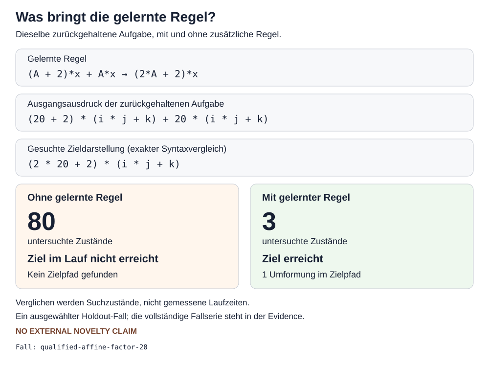
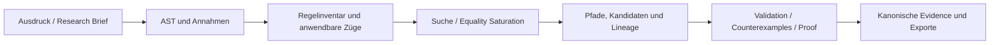

# Regelsuche

[](https://github.com/carstenartur/Regelsuche/actions/workflows/gradle.yml)
[](https://carstenartur.github.io/Regelsuche/coverage/)
[](https://carstenartur.github.io/Regelsuche/tests/)
[](https://carstenartur.github.io/Regelsuche/dev/bench/)
[](https://github.com/carstenartur/Regelsuche/dependency-graph/sbom)
[](LICENSE)
[](https://doi.org/10.5281/zenodo.20951900)

**Mathematik als durchsuchbares Spiel:** Regelsuche zeigt nicht nur ein Ergebnis,
sondern die möglichen Züge an jedem Teilausdruck, die untersuchten Alternativen
und den nachvollziehbaren Weg zum Ergebnis. Erfolgreiche, qualifizierte Pfade
können als neue Strategien wiederverwendet werden.

[Demo starten](#schnellstart) ·
[Workbench](docs/web-workbench.md) ·
[Discovery Gallery](docs/demo-gallery.md) ·
[Aktueller Forschungsstand](docs/discovery-status.md) ·
[Architektur](docs/architecture.md) ·
[Unabhängig reproduzieren](docs/independent-reproduction.md)


*Ein Ausdruck ist eine Spielposition. Die Punkte an jedem AST-Knoten sind
konkrete, dort ausführbare Regelanwendungen. Jeder ausgewählte Zug erzeugt einen
neuen vollständigen Ausdruckszustand samt Position, Bindungen, Annahmen und
Replay-Evidence.*

## Was Regelsuche sichtbar macht

| Statt einer Black Box | Regelsuche zeigt |
| --- | --- |
| nur das Endergebnis | alternative Rechenwege und den erkundeten Suchraum |
| einen undurchsichtigen Simplifier-Aufruf | die konkrete Regel an der konkreten AST-Position |
| ungebundene Heuristik | Kosten, Budgets, Pruninggründe und Annahmen |
| eine neu gelernte Abkürzung ohne Herkunft | den expandierbaren primitiven Pfad und seine Lineage |
| einen Solverstatus ohne Artefakte | Obligation, Backend-Ausgabe, Hashes und reproduzierbare Evidence |

Best-First, Beam, `A*`, Monte Carlo und Equality Saturation können auf denselben
expliziten Zuständen und Kanten arbeiten. Die grafische Workbench verbindet
Suchgraph, Pfade, Replay, AST-Regelradar, Kandidaten, Proof-Jobs und Exporte in
einem Ablauf.

## Beispiel: eine versteckte Faktorisierung als Suchraum

Ausgangspunkt und Ziel des generierten Sophie-Germain-Szenarios sind:

```text
x^4 + 4*y^4

→ (x^2 - 2*x*y + 2*y^2) * (x^2 + 2*x*y + 2*y^2)
```

Interessant ist nicht, dass die bekannte Identität irgendwo hinterlegt werden
könnte. Der Lauf behält vielmehr die tatsächlich untersuchten Zustände, die
vorbereitende Bridge, die primitive Faktorisierung, das daraus gebildete Makro
und dessen spätere Wiederverwendung. Die folgende Darstellung wird aus der
kanonischen Evidence erzeugt, nicht für das README nachgezeichnet.


[Evidence dieses Laufs](docs/generated/discovery/sophie-germain/evidence.json) ·
[visuelle Discovery Gallery](docs/demo-gallery.md) ·
[domänenbewusste Polynomfaktorisierung](docs/domain-aware-polynomial-factorization.md)

## Lernen muss sich auf unbekannten Fällen auszahlen

Der qualifizierte autonome Walkthrough bildet aus targetfreien Beobachtungen
einen parametrisierten Kandidaten, trennt Kandidatenbildung und Prüfung und
misst anschließend die Wiederverwendung auf zurückgehaltenen Aufgaben. Im vom
Evidence-Bundle ausgewählten Beispiel erreicht die Baseline das Ziel innerhalb
von 80 untersuchten Zuständen nicht; mit dem Kandidaten wird es in einem Schritt
bei drei untersuchten Zuständen erreicht.



Die vollständige Fallserie, Kandidaten-Lineage, Hashbindung und unabhängige
Prüfung stehen im [Autonomous Discovery Walkthrough](docs/autonomous-discovery-walkthrough.md).
Das ist projektinterne, symbolisch geprüfte Wiederverwendung — **keine
Behauptung externer mathematischer Neuheit**.

## Workbench statt Konsolenausgabe

Browser-E2E-Tests prüfen die sichtbaren Abläufe und erzeugen dieselben
Dokumentationsaufnahmen. Der folgende kompakte Ausschnitt zeigt einen Lauf, in
dem ein mehrstufiger Pfad als Makro gelernt und erneut verwendet wird.


<table>
<tr>
<td width="50%"><strong>Rationale Ausdrücke</strong><br></td>
<td width="50%"><strong>Matrizen</strong><br></td>
</tr>
</table>

Weitere sichtbare Abläufe: [Pfade, Graph und Replay](docs/web-ui-user-guide.md),
[AST-Regelradar](docs/ast-rule-radar.md),
[Proof Workbench](docs/proof-workbench.md) und
[User Workflows](docs/user-workflows.md).

## In wenigen Zeilen erweitern

### Eine mathematische Regeldatei

Regeln, Makros und Aktivierungsprofile können in einer kleinen DSL beschrieben
werden:

```text
rule difference_of_squares:
  pattern: A^2 - B^2
  replace: (A - B) * (A + B)
  direction: forward
  priority: 5
  tags:
    - factorization
  explanation: "Erkennt die Differenz zweier Quadrate."
```

Die Regel erscheint anschließend wie eine eingebaute Regel im Suchgraphen,
Replay und AST-Regelradar. Bedingungen, Profile, Import, Export und Debugging
beschreibt die Seite [Regeldateien](docs/rule-files.md).

### Eine Suchstrategie als typisiertes Java-Programm

Vorhandene Engines lassen sich ohne zweite Suchimplementierung kombinieren:

```java
import static de.regelsuche.search.program.RewritePrograms.*;

RewriteProgram strategy = firstApplicable(
    "learn-or-derive",
    source("learned-macros", macroEngine),
    sequence(
        "normalize-then-factor",
        source("normalization", normalizationEngine),
        source("factorization", factorizationEngine)
    ),
    source("ordinary-rules", ordinaryRuleEngine)
);
```

`Require`, `Prioritize` und `Prune` bleiben getrennte Operationen; Tracing kann
Kandidaten, verworfene Alternativen und reale Kürzungen sichtbar machen. Details
stehen unter [Java-internal Rewrite Programs](docs/java-rewrite-programs.md) und
[Plugin-API](docs/plugin-api.md).

## Repräsentationsbrücken öffnen neue Mathematikbereiche

Regelsuche behandelt geeignete Gleichungssysteme nicht nur als Listen skalarer
Zeilen. Mit explizit deklarierten Rollen kann beispielsweise

```text
a*x + b*y = lambda*x
c*x + d*y = lambda*y
```

als Eigenproblem `A*v = lambda*v` erkannt, in die exakte Koeffizientenmatrix

```text
[[a-lambda, b],
 [c, d-lambda]]
```

überführt und bis `det(A - lambda*I) = 0` weitergeführt werden. Variablennamen
allein erzeugen keine physikalische Interpretation. Siehe
[Symbolische Gleichungssysteme und Eigenprobleme](docs/symbolic-eigenproblem-representation.md).

## Schnellstart

Die **Standarddemo läuft ohne externe Infrastruktur**. Sie benötigt weder eine
Datenbank noch einen externen Solver und wird ausschließlich lokal veröffentlicht:

```bash
docker build -t regelsuche .
docker run --rm -p 127.0.0.1:8080:8080 regelsuche
```

Danach `http://127.0.0.1:8080/` öffnen und eine der geführten Demos starten.
Suchgraph, gefundene Pfade, Replay, AST-Regelradar, Proof-Jobs und Exporte sind
in derselben Workbench erreichbar.

Die ungebundene Variante `docker run --rm -p 8080:8080 regelsuche`
veröffentlicht die Demo auf allen Host-Interfaces. Sie ist für die lokale
Standarddemo nicht empfohlen und nur in bewusst isolierten Umgebungen sinnvoll.

Ohne Docker genügt mit JDK 25:

```bash
./gradlew run
```

Der vollständige Einstieg einschließlich Sicherheitshinweisen und
Fehlerdiagnose steht in [Getting Started](docs/getting-started.md).

## Optional: Full Mode

Docker Compose ist **nur optional** und **keine Voraussetzung** für die
Standarddemo. Der Full Mode ergänzt PostgreSQL, Hibernate ORM/Search,
persistente Volumes und optional Neo4j-Provenienz:

```bash
docker compose up --build
```

Das optionale Neo4j-Profil startet mit:

```bash
docker compose --profile neo4j up --build
```

Details und Produktionsgrenzen stehen in
[Persistenz und Full Mode](docs/persistence.md).

## Implementierte Bausteine

| Bereich | Gegenwärtiger Stand | Vertiefung |
| --- | --- | --- |
| Suchraum und Erklärung | mehrere Suchverfahren, explizite Zustände und Kanten, Pfade, Replay und Exporte | [Search Intelligence](docs/search-intelligence.md) |
| Lokale Regelanwendung | positionsbezogene Kandidaten, Bindungen, Annahmen, Vorschau und Suchstatus | [AST-Regelradar](docs/ast-rule-radar.md) |
| Regelvorbereitung | direkte Anwendung, typisierte Guards, native Exact-Spezialisten und begrenzte lokale Bridges | [Safe Rule Preparation Coordinator](docs/safe-rule-preparation-coordinator.md) |
| Lernen und Wiederverwendung | Kandidatenbildung, Counterexamples, Holdouts, Generationsbarrieren und Schatteninventare | [Generational Rule Mining](docs/generational-rule-mining.md) |
| Polynome | exakte `Z[x]`-/`Q[x]`-Repräsentation, native univariate Faktorisierung, Vorschlagsadapter und unabhängige Produktprüfung | [Polynomfaktorisierung](docs/domain-aware-polynomial-factorization.md) |
| Gleichungssysteme | exaktes `A*x=b`, Blockzerlegung, RREF, Lösungsklassifikation und explizite Eigenproblemrollen | [Representation Bridges](docs/equation-system-matrix-representation.md) |
| Proof | versionierte Obligationen, Z3/cvc5, optional Lean sowie getrennte Job- und mathematische Status | [Proof Workbench](docs/proof-workbench.md) |
| Erweiterungen | Regeldateien, Knowledge Packs, Java-Plugins, Makros und typisierte Rewrite-Programme | [Extension System](docs/extension-system.md) |
| Reproduzierbarkeit | kanonische JSON-Artefakte, Manifeste, Hashes, Containerläufe und unabhängige Verifier | [Scientific Reproducibility](docs/scientific-reproducibility.md) |

Nicht jede implementierte Fähigkeit ist bereits als allgemeines
Workbench-Defaultprofil qualifiziert. Der datierte Stand mit ausgeführten und
noch offenen Prüfungen steht in [Discovery- und Forschungsstatus](docs/discovery-status.md).

## Discovery evidence

Regelsuche hält exemplarische Discovery-Läufe als generierte, nachvollziehbare
Evidence fest. Die Beispiele belegen Suchpfade, Bridge-Bildung und
Makrowiederverwendung; sie sind keine Behauptung externer mathematischer Neuheit.

| Scenario | Bridge | Macro learned | Macro reused | Evidence |
|---|---:|---:|---:|---|
| Complete square | yes | yes | yes | [regelsuche.discovery-evidence/v1#sha256:217d5ca4dff3dba588f16d8451195a883378956a795259936317d3d35e8ce273](docs/generated/discovery/complete-square/evidence.json) |
| Sophie-Germain | yes | yes | yes | [regelsuche.discovery-evidence/v1#sha256:ad5a70e80124c9154f03c870b1f1b6d26fe482463eeb991d805f14eef38a1f31](docs/generated/discovery/sophie-germain/evidence.json) |

`Sophie-Germain` bezeichnet hier die eingefrorene historische Szenario- und
Evidence-Identität. Neue allgemeine Discovery-Profile verwenden für den
unterstützten Quartikbereich den semantischen Syntheseoperator; der frühere
benannte Bridge bleibt nur zur Reproduktion und Ablation erhalten.

Die [Discovery Gallery](docs/demo-gallery.md) zeigt ausschließlich aus Tests
beziehungsweise Evidence-Generatoren abgeleitete Darstellungen. Manuell
nachgezeichnete Erfolgsbilder sind kein Ersatz für gebundene Artefakte.

<!-- capability-status:start -->
## Verifizierter Capability- und Claim-Status

Die folgende Kurzmatrix wird aus den kanonischen Release-, Domain- und Trust-Verträgen erzeugt. Die vollständige Matrix mit Evidence-Roots steht in [`capability-status.md`](docs/generated/capability-status.md).

| Capability | Status |
|---|---|
| `AUTONOMOUS_CAMPAIGN` | `QUALIFIED` |
| `DOMAIN_GENERIC_DISCOVERY` | `QUALIFIED` |
| `EXTERNAL_NOVELTY_REVIEW` | `BLOCKED` |
| `FORMAL_PROOF_OF_RETAINED_CANDIDATE` | `NOT_EVALUATED` |
| `PLUGIN_ARTIFACT_TRUST` | `IMPLEMENTED` |
| `PLUGIN_INDEX_AUTHENTICATION` | `IMPLEMENTED` |
| `PLUGIN_TRUST_STATE_REVISIONS` | `IMPLEMENTED` |
| `PROMOTION` | `NOT_EVALUATED` |
| `PUBLIC_EVIDENCE` | `NOT_EVALUATED` |
| `PUBLIC_PLUGIN_DISTRIBUTION` | `BLOCKED` |

`QUALIFIED` autorisiert nur den jeweils benannten Claim. Externe mathematische Neuheit, formaler Beweis, Promotion und Public Evidence werden nicht aus einem anderen erfolgreichen Profil abgeleitet.
<!-- capability-status:end -->

Regelsuche ist weder ein allgemeiner Ersatz für ein Computer-Algebra-System noch
ein Automatismus für mathematische Neuheit. Sucherfolg, Validierung, formaler
Beweis, Projekt-Neuheit, externe Neuheit und Veröffentlichung bleiben getrennte,
fehlersicher sperrende Evidenzstufen.

## Systemmodell



Der mathematische Kern bleibt von Web, Datenbanken und GitHub Actions getrennt.
Die exakten Modulgrenzen und erlaubten Abhängigkeitsrichtungen sind in
[Architektur](docs/architecture.md), [Modulstruktur](docs/module-structure.md)
und [Dependency-Regeln](docs/dependency-rules.md) dokumentiert.

## Betriebsmodi

| Modus | Zweck | Start |
| --- | --- | --- |
| Standarddemo | lokale Workbench ohne externe Infrastruktur | `docker run` oder `./gradlew run` |
| Full Mode | PostgreSQL, Hibernate ORM/Search und optionale Neo4j-Provenienz | `docker compose up --build` |
| Proof-Image | Z3 und cvc5; Lean optional | `Dockerfile.proof` |
| Forschungsreproduktion | Evidence- und Containerverträge aus dem Checkout | `./gradlew --no-configuration-cache ciCheck` und spezialisierte Reproduktionstasks |

Die lokale Demo verwendet HTTP ohne Anmeldung. Für externe Erreichbarkeit sind
authentifiziertes TLS, eigene Zugangsdaten und eine geeignete Betriebsumgebung
erforderlich.

## Verifikation aus einem Checkout

Die Test- und Evidence-Logik liegt im Repository, nicht in GitHub Actions:

```bash
./gradlew test                              # alle Gradle-Testschichten
./gradlew check                             # Tests plus checkout-lokale Vertragsprüfung
./gradlew fullCheck                         # zusätzlich Docker-, Solver- und Reproduktionsverträge
./gradlew --no-configuration-cache ciCheck  # exakter autoritativer CI-Lebenszyklus
```

GitHub Actions provisioniert nur die Umgebung und veröffentlicht bereits lokal
erzeugte Ergebnisse. Details und fokussierte Tasks beschreibt
[Testing](docs/testing.md).

## Dokumentation nach Zielgruppe

- **Nutzung:** [Getting Started](docs/getting-started.md),
  [Web-Workbench](docs/web-workbench.md),
  [User Workflows](docs/user-workflows.md),
  [Demo Gallery](docs/demo-gallery.md)
- **Forschung und Evidenz:** [Discovery-Status](docs/discovery-status.md),
  [Autonomous Discovery Walkthrough](docs/autonomous-discovery-walkthrough.md),
  [Discovery Evidence](docs/discovery-evidence-v1.md),
  [Generational Rule Mining](docs/generational-rule-mining.md),
  [Polynomfaktorisierung](docs/domain-aware-polynomial-factorization.md),
  [Benchmarks](docs/discovery-benchmarks.md),
  [Scientific Reproducibility](docs/scientific-reproducibility.md)
- **Entwicklung:** [Architektur](docs/architecture.md),
  [Developer Guide](docs/developer-guide.md), [Testing](docs/testing.md)
- **Erweiterungen:** [Erweiterungssystem](docs/extension-system.md),
  [Plugin-API](docs/plugin-api.md), [Regeldateien](docs/rule-files.md),
  [Java Rewrite Programs](docs/java-rewrite-programs.md)
- **Referenz:** [Dokumentationsindex](docs/README.md),
  [Glossar](docs/glossary.md), [Schema-Katalog](docs/schema-catalog.md),
  lokale Swagger UI unter `/static/openapi/index.html`

## Mitwirken

Änderungen sollen lokal reproduzierbar bleiben. Der
[Developer Guide](docs/developer-guide.md) enthält den empfohlenen Ablauf; die
[Dokumentationskonventionen](docs/documentation-conventions.md) und die
[Qualitätscheckliste](docs/documentation-quality-checklist.md) gelten für
README, Handbücher, Forschungsseiten und generierte Dokumentation.

## Zitation und Lizenz

Bitte die in [CITATION.cff](CITATION.cff) hinterlegte Version zitieren. Der
archivierte Datensatz ist über DOI
[`10.5281/zenodo.20951900`](https://doi.org/10.5281/zenodo.20951900)
erreichbar.

Regelsuche steht unter der [MIT-Lizenz](LICENSE).
