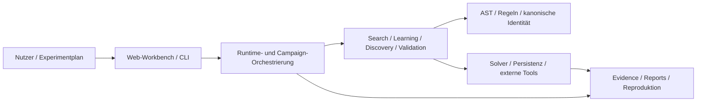
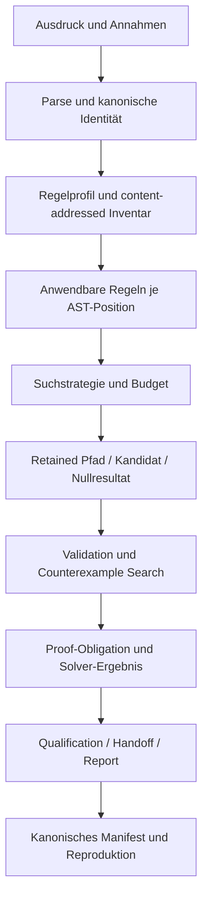

# Architektur

Regelsuche ist ein Gradle-Multi-Projekt mit einem technologiearmen
mathematischen Kern, expliziten Capability-Modulen und einer dünnen
Laufzeitkomposition. Die Architektur soll drei Eigenschaften gleichzeitig
sichern:

1. mathematische Semantik bleibt unabhängig von Web, Datenbanken und CI;
2. Such-, Lern- und Evidence-Ergebnisse bleiben reproduzierbar und
   nachvollziehbar;
3. externe Systeme dürfen Claims nur innerhalb ihrer ausdrücklich gebundenen
   Rolle beeinflussen.

Die exakten Projektabhängigkeiten stehen in [Dependency-Regeln](dependency-rules.md),
die aktuelle Paketzuordnung in [Modulstruktur](module-structure.md).

## Systemkontext



Die Web-Workbench und die CLI sind Eingänge in dieselben fachlichen
Komponenten. GitHub Actions ist kein Teil der fachlichen Architektur: Der
autoritative Verifikationsvertrag liegt im Checkout.

## Architekturschichten

### 1. Mathematische Grundlage

- `regelsuche-core` — AST, Parser, kanonische Ausdrucksidentität, atomare
  Transformationen und grundlegende mathematische Typen.
- `regelsuche-egraph` — Equality-Saturation-Strukturen auf Basis des Core.
- `regelsuche-search` — Suchprobleme, Strategien, Scoring, Budgets,
  Frontier- und Transposition-Memory.
- `regelsuche-validation` — Äquivalenz-, Annahmen- und Validierungsverträge.
- `regelsuche-solver-ir` — solver-neutrale Obligationen und Ergebnisse.
- `regelsuche-math-algorithms` und `regelsuche-math-jas` — klar abgegrenzte
  mathematische Algorithmen und optionale Backend-Integration.

Diese Schicht darf keine Web-, Datenbank-, Testcontainers- oder
GitHub-spezifischen Abhängigkeiten benötigen.

### 2. Fachliche Capabilities

- `regelsuche-learning` — Mining, Anti-Unification, Kandidaten- und
  Rewrite-Program-Lernen.
- `regelsuche-discovery` — domänenneutrale Discovery-Verträge und
  Lifecycle-Handoffs.
- `regelsuche-experiments` — Experiment-, Benchmark- und Corpus-Primitiven.
- `regelsuche-benchmarks` — vergleichende und kandidatunabhängige
  Benchmarkausführung.
- `regelsuche-persistence` — technologiearme Persistenzports und Checkpoints.
- `regelsuche-persistence-hibernate` — relationale und Hibernate-Search-
  Adapter.
- `regelsuche-solver-portfolio` — capability-aware Auswahl und Ausführung
  mehrerer Solver-Backends.

Capabilities kommunizieren über versionierte Typen und explizite Ports. Ein
Backend darf nicht stillschweigend zusätzliche Semantik in den Kern einführen.

### 3. Orchestrierung und Auslieferung

- `regelsuche-autopilot` — begrenzte Campaign-Planung, Ausführung und
  Ressourcenbilanz.
- `regelsuche-release` — Qualification, Release-Profile, Result Cards und
  Reproduktionsartefakte.
- `regelsuche-cli` — wiederverwendbare CLI-Optionen und Command-Primitiven.
- `app` — Runtime-Wiring, Web-Workbench, konkrete CLI, HTTP, Adapterauswahl und
  End-to-End-Komposition.

`app` ist die äußere Hülle. Neue fachliche Logik soll nur dort verbleiben, wenn
sie tatsächlich Laufzeitkomposition oder Infrastruktur ist.

## Fachliches Ausführungsmodell



### AST und Suchgraph

Ein vollständiger Ausdruck ist ein Zustand im globalen Suchgraphen. Innerhalb
dieses Zustands besitzt der Ausdruck einen AST. Eine konkrete Suchkante besteht
aus:

- einer AST-Position;
- einer ausführbaren Regel und ihrer Herkunft;
- den gebundenen Platzhaltern;
- den emittierten Annahmen oder Nebenbedingungen;
- dem erzeugten vollständigen Folgeausdruck;
- Kosten-, Work- und Trace-Metadaten.

Der [AST-Regelradar](ast-rule-radar.md) macht genau diese lokale
Position-zu-Kante-Beziehung sichtbar. AST und Suchgraph sind unterschiedliche
Strukturen und dürfen nicht vermischt werden.

## Regel- und Erweiterungsmodell

Regeln werden nach Herkunft und Vertrauensgrenze unterschieden:

1. **Kernel-Regeln** — minimaler, stabiler Kern;
2. **First-Party-Packs** — kuratierte Fähigkeiten mit eigener Aktivierung;
3. **Regeldateien und deklarative Makros** — lokale, prüfbare Erweiterungen;
4. **Java-Plugins** — externe ausführbare Erweiterungen;
5. **gelernte Kandidaten und Makros** — zunächst quarantänisiert, erst nach
   eigenen Gates aktivierbar.

Ein content-addressed Regelinventar bindet das tatsächlich aktive Profil. Damit
lassen sich Ablationen durchführen, ohne Ergebnisse nachträglich durch ein
verändertes Inventar umzudeuten. Details:
[Regel-Tiers und Ablation](rule-tiers.md) und
[Erweiterungssystem](extension-system.md).

## Evidence-Architektur

Regelsuche behandelt Evidence als eigenständige Architekturkomponente. Ein
fachliches Ergebnis besteht nicht nur aus einem Endausdruck, sondern aus einer
prüfbaren Kette:

```text
Konfiguration
  → Eingaben und Inventar
  → ausgeführte Arbeit
  → Beobachtungen und Lineage
  → Validierungs-/Proof-Ergebnisse
  → Claim-Entscheidung
  → Manifest und Reproduktionsreceipt
```

### Kanonische und diagnostische Daten

- **Kanonisch:** mathematische Inputs, Konfigurationen, Regelidentitäten,
  Ergebnisse, Work Accounting, Statusvokabular und Hashbindungen.
- **Diagnostisch:** Wandzeit, Hardwaredetails, Logs, Traces und nicht stabile
  Laufzeittelemetrie.

Diagnostische Performance darf Optimierungen begründen, aber keine
mathematische Arbeitsbilanz oder Claim-Schwelle ersetzen.

### Fail-closed Semantik

Fehlende, widersprüchliche oder nicht gebundene Evidence führt zu einem
expliziten Blocker. Ein Schema-valides JSON-Dokument ist noch kein erfolgreicher
wissenschaftlicher Nachweis; unabhängige Verifier prüfen Beziehungen,
Vollständigkeit und Hashes.

## Trust- und Informationsgrenzen

| Grenze | Regel |
| --- | --- |
| Search vs. Validation | Validatoren beurteilen Outputs; sie erzeugen nicht den zu bewertenden Kandidaten |
| TRAIN vs. VALIDATION | VALIDATION darf Konfigurationen auswählen, aber keine TRAIN-Fitness erzeugen |
| VALIDATION vs. FINAL TEST | FINAL TEST wird erst nach eingefrorener Auswahl genau einmal geöffnet |
| Discovery vs. externe Novelty | Literatur- und Expertenwissen darf nicht rückwirkend Candidate Formation beeinflussen |
| Solver vs. Proof Claim | Nur ein tatsächlich bestätigtes Ergebnis autorisiert den entsprechenden Proof-Status |
| Plugin vs. Core | Externe Artefakte werden vor Aktivierung auf Identität, Signatur, Kompatibilität und Policy geprüft |
| GitHub vs. Checkout | Workflows provisionieren und veröffentlichen; Assertions und Evidence-Semantik bleiben lokal |

## Persistenz und Betriebsmodi

Die Ports in `regelsuche-persistence` trennen fachliche Speicherung von der
konkreten Infrastruktur.

- **Standarddemo:** lokale JSON-/Dateispeicherung ohne externe Dienste;
- **Full Mode:** PostgreSQL, Hibernate ORM und Hibernate Search;
- **optionale Graph-Provenienz:** Neo4j;
- **Evidence und Proof-Artefakte:** unveränderliche Dateien und Manifeste unter
  konfigurierten Ausgabepfaden.

Details stehen in [Persistenz](persistence.md) und
[Storage Architecture](storage-architecture.md).

## Verifikation und CI

Die Architektur wird nicht nur beschrieben, sondern durch den Build geprüft:

- Gradle-Projektabhängigkeiten erzwingen die wichtigsten Modulgrenzen;
- JUnit charakterisiert fachliche und infrastrukturelle Verträge;
- Python- und Shell-Verifier prüfen kanonische Artefakte aus dem Checkout;
- Testcontainers führt reale Container- und Datenbankintegration lokal aus;
- `ciCheck` ist der gemeinsame lokale und CI-seitige Einstiegspunkt;
- `verifyWorkflowSemantics` verhindert workfloweigene Parallel-Logik.

Siehe [Testing](testing.md) und [Testing-Strategie](testing-strategy.md).

## Regeln für Architekturänderungen

Eine Änderung an einer Modul- oder Trust-Grenze benötigt:

1. eine fachliche Begründung und benannte Verantwortung;
2. eine explizite Abhängigkeitsrichtung;
3. Charakterisierung der positiven und negativen Semantik;
4. Auswirkungen auf kanonische Identitäten und Evidence;
5. Migrations- oder Versionsentscheidung für externe Verträge;
6. Aktualisierung der relevanten Architektur- und Betriebsdokumentation;
7. bei grundlegenden Entscheidungen einen ADR unter [`docs/adr/`](adr/).

Bevor eine neue Technologieabhängigkeit in ein inneres Modul aufgenommen wird,
ist zu prüfen, ob ein Port und ein äußerer Adapter die geeignetere Grenze sind.
