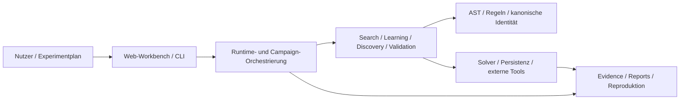
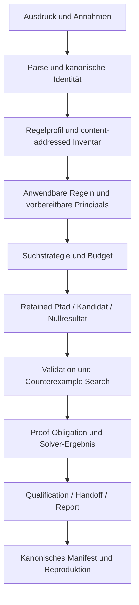
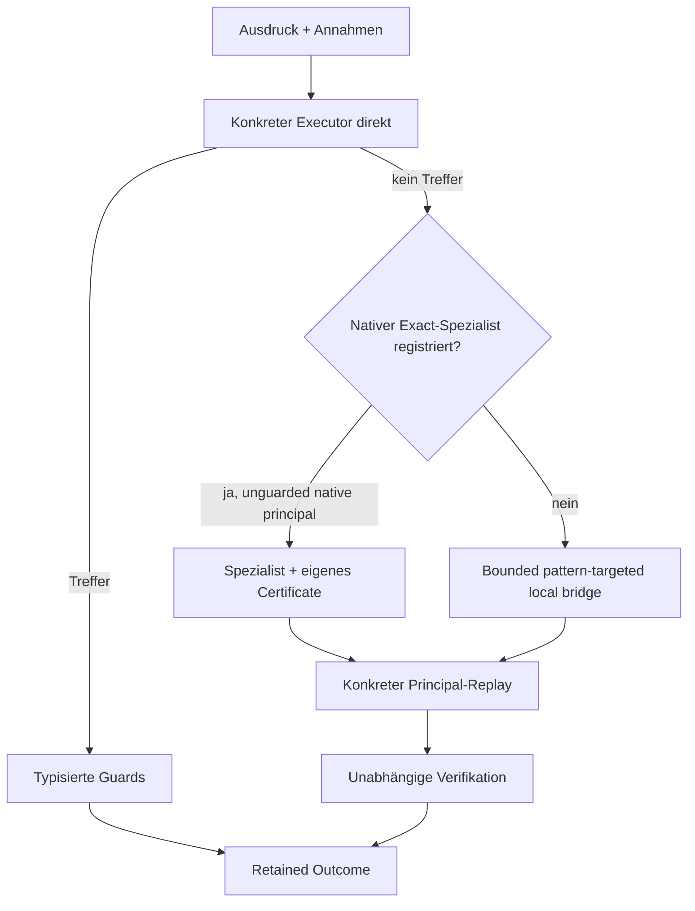
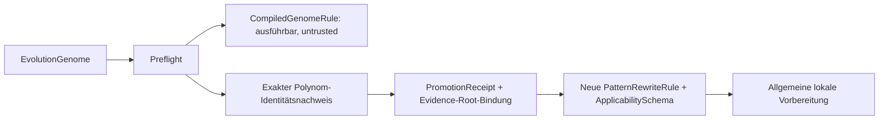
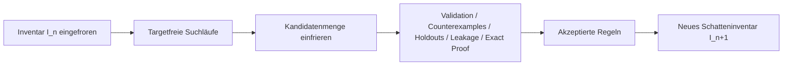

# Architektur

Regelsuche ist ein Gradle-Multi-Projekt mit einem technologiearmen
mathematischen Kern, expliziten Capability-Modulen und einer dünnen
Laufzeitkomposition. Die Architektur soll drei Eigenschaften gleichzeitig
sichern:

1. mathematische Semantik bleibt unabhängig von Web, Datenbanken und CI;
2. Such-, Lern- und Evidence-Ergebnisse bleiben reproduzierbar und
   nachvollziehbar;
3. externe Systeme dürfen Claims nur innerhalb ihrer ausdrücklich gebundenen
   Rolle beeinflussen.

Die exakten Projektabhängigkeiten stehen in [Dependency-Regeln](dependency-rules.md),
die aktuelle Paketzuordnung in [Modulstruktur](module-structure.md).

## Systemkontext



Die Web-Workbench und die CLI sind Eingänge in dieselben fachlichen
Komponenten. GitHub Actions ist kein Teil der fachlichen Architektur: Der
autoritative Verifikationsvertrag liegt im Checkout.

## Architekturschichten

### 1. Mathematische Grundlage

- `regelsuche-core` — AST, Parser, kanonische Ausdrucksidentität, atomare
  Transformationen, exakte Vorbereitungsspezialisten und deren Registry,
  semantische Views sowie exakte Koeffizientendomänen, Polynomringe,
  Faktorisierungsengine- und Verifier-Verträge.
- `regelsuche-egraph` — Equality-Saturation-Strukturen auf Basis des Core.
- `regelsuche-search` — Suchprobleme, Strategien, Scoring, Budgets,
  Frontier-/Transposition-Memory und die Koordinatoren für direkte, exakte und
  lokal mustergerichtete Regelvorbereitung.
- `regelsuche-validation` — Äquivalenz-, Annahmen- und Validierungsverträge.
- `regelsuche-solver-ir` — solver-neutrale Obligationen und Ergebnisse.
- `regelsuche-math-algorithms` und `regelsuche-math-jas` — klar abgegrenzte
  mathematische Algorithmen und optionale Backend-Integration.

Diese Schicht darf keine Web-, Datenbank-, Testcontainers- oder
GitHub-spezifischen Abhängigkeiten benötigen.

### 2. Fachliche Capabilities

- `regelsuche-learning` — Mining, Anti-Unification, Kandidaten- und
  Rewrite-Program-Lernen, generationengetrennte Schatteninventare sowie die
  enge Promotion exakt bewiesener assumption-free Polynom-Pattern.
- `regelsuche-discovery` — domänenneutrale Discovery-Verträge und
  Lifecycle-Handoffs.
- `regelsuche-experiments` — Experiment-, Benchmark- und Corpus-Primitiven.
- `regelsuche-benchmarks` — vergleichende und kandidatunabhängige
  Benchmarkausführung.
- `regelsuche-persistence` — technologiearme Persistenzports und Checkpoints.
- `regelsuche-persistence-hibernate` — relationale und Hibernate-Search-
  Adapter.
- `regelsuche-solver-portfolio` — capability-aware Auswahl und Ausführung
  mehrerer Solver-Backends.

Capabilities kommunizieren über versionierte Typen und explizite Ports. Ein
Backend darf nicht stillschweigend zusätzliche Semantik in den Kern einführen.

### 3. Orchestrierung und Auslieferung

- `regelsuche-autopilot` — begrenzte Campaign-Planung, Ausführung und
  Ressourcenbilanz.
- `regelsuche-release` — Qualification, Release-Profile, Result Cards und
  Reproduktionsartefakte.
- `regelsuche-cli` — wiederverwendbare CLI-Optionen und Command-Primitiven.
- `app` — Runtime-Wiring, Web-Workbench, konkrete CLI, HTTP, Adapterauswahl und
  End-to-End-Komposition.

`app` ist die äußere Hülle. Neue fachliche Logik soll nur dort verbleiben, wenn
sie tatsächlich Laufzeitkomposition oder Infrastruktur ist.

## Fachliches Ausführungsmodell



### AST und Suchgraph

Ein vollständiger Ausdruck ist ein Zustand im globalen Suchgraphen. Innerhalb
dieses Zustands besitzt der Ausdruck einen AST. Eine konkrete Suchkante besteht
aus:

- einer AST-Position;
- einer ausführbaren Regel und ihrer Herkunft;
- den gebundenen Platzhaltern;
- den emittierten Annahmen oder Nebenbedingungen;
- dem erzeugten vollständigen Folgeausdruck;
- Kosten-, Work- und Trace-Metadaten.

Der [AST-Regelradar](ast-rule-radar.md) macht genau diese lokale
Position-zu-Kante-Beziehung sichtbar. AST und Suchgraph sind unterschiedliche
Strukturen und dürfen nicht vermischt werden.

## Vorbereitung fast passender Regeln

Die sichere Vorbereitung besitzt eine explizite Trust-Reihenfolge:



Wesentliche Grenzen:

- Der konkrete Executor wird vor der Applicability-Schemaanalyse versucht.
- `RewriteApplicabilitySchema` beschreibt Anwendbarkeit und Guards, erzeugt aber
  keinen Ergebnis-AST.
- `SafePreparationEngineRegistry` bindet die vorhandenen exakten Spezialsolver
  an Reihenfolge, Implementierung und native Principal-ID.
- Ein nur ähnlich aussehendes Pattern erbt keinen fremden Solververtrag.
- Der allgemeine lokale Fallback arbeitet unter einem eingefrorenen,
  äquivalenzbewahrenden Vorbereitungsinventar.
- Technische Fehler werden retained und nicht als Nichtanwendbarkeit getarnt.
- Historische Evidence behält ihre damaligen Engine- und Inventaridentitäten.

Der `UnifiedRulePreparationCoordinator` ist implementiert und charakterisiert,
aber noch nicht als allgemeines Workbench-/CLI-Defaultprofil ausgewählt.
Details stehen unter
[Sicherer Regelvorbereitungskoordinator](safe-rule-preparation-coordinator.md).

## Trust-Grenze für gelernte Regeln

Gelernte Kandidaten durchlaufen zwei unterschiedliche Ausführungsklassen:



Rohe `CompiledGenomeRule`s deklarieren bewusst keine Äquivalenzerhaltung. Der
erste Promotionsadapter akzeptiert nur assumption-free Identitäten in einem
begrenzten exakten Polynomfragment. Er bindet Evidence-Root-Hashes, lädt oder
verifiziert deren Artefakte in v1 aber nicht selbst. Der übergeordnete
Qualification-/Release-Lifecycle bleibt daher zwingend.

Die Implementierung eines Mechanismus ändert den öffentlichen Capability-Claim
nicht: `PROMOTION` bleibt bis zu einer realen qualifizierten Promotion
`NOT_EVALUATED`. Gelernte `RewriteProgram`s benötigen eine eigene
programmbasierte Applicability-/Replay-Grenze.

Details:
[Promotion gelernter Pattern-Regeln](learned-pattern-rule-promotion.md).

## Generationengetrennte Schatteninventare

Regelbildung und Regelverwendung sind im experimentellen Lernpfad nicht dieselbe
Operation. Jede Generation arbeitet gegen eine eingefrorene Inventarrevision:



Architekturregeln:

- Eine in Generation `n` gebildete Regel darf frühestens in Generation `n+1`
  ausgeführt werden.
- Inventar, Aufgaben, Budgets, Regelquellen und Berichtsrevision sind vor jeder
  Generation eingefroren und content-addressed.
- Akzeptierte und verworfene Kandidaten bleiben einschließlich terminaler Gründe
  und Work Accounting erhalten.
- Ein positives kumulatives Ergebnis muss die tatsächlich verwendete
  Regelgeneration im Replay nachweisen; bloße Inventaranwesenheit genügt nicht.
- Die Kampagne verändert ausschließlich ein experimentelles Schatteninventar.
  Produktionsinventar und Capability-Status werden nicht implizit mutiert.

Damit verhindert die Architektur same-generation feedback und eine
nachträgliche Vermischung von Such- und Qualifikationswissen. Der Mechanismus
ist in [Generational Rule Mining](generational-rule-mining.md) dokumentiert.

## Repräsentationsbrücken

Nicht jede mathematische Verbesserung ist ein skalares AST-Rewrite. Exakte
Gleichungssysteme besitzen einen eigenen Objektpfad:

```text
skalare affine Gleichungen
  -> A*x=b
  -> unabhängige Blöcke
  -> RREF
  -> eindeutige, parametrisierte oder inkonsistente Lösung
```

Mit expliziten Modellrollen können symbolische Systeme außerdem als
Eigenproblem erkannt werden. Diese Brücken behalten Relationstyp,
Objektidentität, Variablenrollen und Round-trip-Evidence. Sie werden nicht in
einen einzelnen Ausdrucksstring abgeflacht.

Die direkte Teilnahme dieser typisierten Objektbrücken am Unified Preparation
Coordinator bleibt eine offene Integrationsgrenze.

## Domänenbewusste Polynomdarstellung und Faktorisierung

Eine semantische View ist weder bloße Formatierung noch automatisch ein Beweis.
Die Polynomarchitektur trennt deshalb Syntaxinterpretation, mathematische
Identität, algorithmische Vorschläge und autorisierte Evidence:

```mermaid
flowchart LR
    source[ExactParsedTerm] --> view[PolynomialSemanticView]
    view --> ring[CoefficientDomain + PolynomialRing]
    ring --> polynomial[Canonical SparsePolynomial]
    polynomial --> request[FactorizationRequest]
    request --> engine[FactorizationEngine: untrusted proposals]
    engine --> verifier[FactorizationVerifier]
    verifier --> evidence[Verified candidates + report evidence]
    evidence --> adapter[Search / Discovery adapter]
```



Der mathematische Kern enthält:

- `CoefficientDomain<C>` und getrennte algebraische Fähigkeiten wie
  `ExactField<C>` und `GcdDomain<C>`;
- einen `PolynomialRing<C>` mit geordneten Variablen und ausdrücklich gewählter
  Monomordnung;
- ein unveränderliches, kanonisches `SparsePolynomial<C>`;
- typisierte Faktorisierungsanforderungen mit einem nicht zurücksetzbaren
  Gesamtbudget;
- eine backendneutrale Engine-Schnittstelle;
- einen unabhängigen Verifier als einzige Quelle vertrauenswürdiger
  Faktorisierungsevidence.

`PolynomialSemanticView` liest numerische Koeffizienten und Exponenten nur aus
parserausgestellter exakter Literalprovenienz. Der historische
`NumberExpr(double)`-Wert ist keine Quelle exakter Mathematik. Konkrete
AST-Vorkommen und Anzeigezeichenfolgen verbleiben im View; die Engine arbeitet
nur auf dem mathematischen Polynom.

Eine `FactorizationEngine` darf Kandidaten vorschlagen und eigene Backend-Claims
retained ausgeben. Diese Daten sind ausdrücklich untrusted. Erst
`FactorizationVerifier` prüft mindestens:

- Engine- und Koeffizientendomänenidentität;
- Request-, Kandidaten- und Work-Budgets;
- Ringgleichheit aller Faktoren und des Restes;
- exakte Rückmultiplikation von Einheit, Faktoren, Multiplizitäten und Rest;
- die Trennung von Backend-Claim und unabhängig autorisierter Claim-Stärke.

Das stage-getrennte Work Ledger besitzt eine tatsächlich kanonische
Schlüsselreihenfolge. Hashmaterial darf nicht von der nicht spezifizierten
Iterationsreihenfolge einer unveränderlichen Java-Map abhängen.

Die erste integrierte Engine ist
`BinaryQuarticFactorizationEngine`. Sie löst begrenzt und exakt die
quadratisch-mal-quadratisch-Zerlegung binärer homogener Quartiken. Der
`PolynomialDecompositionSynthesisOperator` ist nur noch ein Adapter vom
Ausdruckspfad zur Engine-/Verifier-Grenze und zurück zur Suchkante. Seine
historische Bezeichnung definiert weder das Polynommodell noch die allgemeine
Faktorisierungs-API.

Wesentliche Grenzen:

- Ein Engine-Miss ist kein Irreduzibilitätsbeweis.
- Ein Backend-Claim ist keine unabhängig zertifizierte Vollständigkeit.
- Die aktuelle Quartikengine belegt eine exakte Zerlegung, nicht die
  Irreduzibilität jedes ausgegebenen Faktors.
- Vollständige Faktorisierung über `Z[x]` oder `Q[x]`, endliche Körper,
  Hensel-Lifting, Rekombination und multivariate Verfahren sind Folgearbeiten.
- Die früheren verschachtelten Quartiktypen werden nicht als parallele
  Kompatibilitäts-API weitergeführt.

Details stehen in
[Domänenbewusste Polynomfaktorisierung](domain-aware-polynomial-factorization.md),
[Semantische Polynomansicht und quartische Zerlegungsengine](polynomial-decomposition-synthesis.md)
und im
[ADR zum domänenbewussten Polynomkern](adr/domain-aware-polynomial-factorization.md).

## Regel- und Erweiterungsmodell

Regeln werden nach Herkunft und Vertrauensgrenze unterschieden:

1. **Kernel-Regeln** — minimaler, stabiler Kern;
2. **First-Party-Packs** — kuratierte Fähigkeiten mit eigener Aktivierung;
3. **Regeldateien und deklarative Makros** — lokale, prüfbare Erweiterungen;
4. **Java-Plugins** — externe ausführbare Erweiterungen;
5. **gelernte Kandidaten und Makros** — zunächst quarantänisiert; ein enger
   exakt bewiesener Patternpfad kann eine neue promoted Regelidentität erzeugen,
   die allgemeine Promotion bleibt aber separat zu qualifizieren.

Ein content-addressed Regelinventar bindet das tatsächlich aktive Profil. Damit
lassen sich Ablationen durchführen, ohne Ergebnisse nachträglich durch ein
verändertes Inventar umzudeuten. Semantische Syntheseoperatoren besitzen eine
eigene Theorie- und Budgetidentität und werden nicht als unmarkierte Kernelregel
in das Inventar hineingerechnet. Details:
[Regel-Tiers und Ablation](rule-tiers.md) und
[Erweiterungssystem](extension-system.md).

## Evidence-Architektur

Regelsuche behandelt Evidence als eigenständige Architekturkomponente. Ein
fachliches Ergebnis besteht nicht nur aus einem Endausdruck, sondern aus einer
prüfbaren Kette:

```text
Konfiguration
  → Eingaben und Inventar
  → ausgeführte Arbeit
  → Beobachtungen und Lineage
  → Validierungs-/Proof-Ergebnisse
  → Claim-Entscheidung
  → Manifest und Reproduktionsreceipt
```

### Kanonische und diagnostische Daten

- **Kanonisch:** mathematische Inputs, Konfigurationen, Regelidentitäten,
  Ergebnisse, Work Accounting, Statusvokabular und Hashbindungen.
- **Diagnostisch:** Wandzeit, Hardwaredetails, Logs, Traces und nicht stabile
  Laufzeittelemetrie.

Diagnostische Performance darf Optimierungen begründen, aber keine
mathematische Arbeitsbilanz oder Claim-Schwelle ersetzen.

### Fail-closed Semantik

Fehlende, widersprüchliche oder nicht gebundene Evidence führt zu einem
expliziten Blocker. Ein Schema-valides JSON-Dokument ist noch kein erfolgreicher
wissenschaftlicher Nachweis; unabhängige Verifier prüfen Beziehungen,
Vollständigkeit und Hashes.

## Trust- und Informationsgrenzen

| Grenze | Regel |
| --- | --- |
| Direct vs. Preparation | Direkter konkreter Executor wird vor jedem schema-gesteuerten Vorbereitungsversuch ausgeführt |
| Exact-Spezialist vs. fremde Regel | Nur die registrierte native Principal-ID erhält den jeweiligen Solververtrag |
| Rohe Lernregel vs. Promotion | Ausführbarkeit oder Fitness autorisiert keine Äquivalenz; Promotion erzeugt eine neue Identität nach eigenem Nachweis |
| Generation `n` vs. `n+1` | Neu gebildete Regeln werden erst nach vollständigem Generationsabschluss im nächsten eingefrorenen Schatteninventar aktiv |
| Semantische View vs. mathematischer Claim | Repräsentationserkennung autorisiert nur einen gebundenen mathematischen Request; Ergebnis und Relation werden separat verifiziert |
| Faktorisierungsengine vs. Verifier | Engine-Proposals und Backend-Claims sind untrusted; nur der unabhängige Verifier autorisiert eine Faktorisierungskante |
| Search vs. Validation | Validatoren beurteilen Outputs; sie erzeugen nicht den zu bewertenden Kandidaten |
| TRAIN vs. VALIDATION | VALIDATION darf Konfigurationen auswählen, aber keine TRAIN-Fitness erzeugen |
| VALIDATION vs. FINAL TEST | FINAL TEST wird erst nach eingefrorener Auswahl genau einmal geöffnet |
| Discovery vs. externe Novelty | Literatur- und Expertenwissen darf nicht rückwirkend Candidate Formation beeinflussen |
| Solver vs. Proof Claim | Nur ein tatsächlich bestätigtes Ergebnis autorisiert den entsprechenden Proof-Status |
| Plugin vs. Core | Externe Artefakte werden vor Aktivierung auf Identität, Signatur, Kompatibilität und Policy geprüft |
| GitHub vs. Checkout | Workflows provisionieren und veröffentlichen; Assertions und Evidence-Semantik bleiben lokal |

## Persistenz und Betriebsmodi

Die Ports in `regelsuche-persistence` trennen fachliche Speicherung von der
konkreten Infrastruktur.

- **Standarddemo:** lokale JSON-/Dateispeicherung ohne externe Dienste;
- **Full Mode:** PostgreSQL, Hibernate ORM und Hibernate Search;
- **optionale Graph-Provenienz:** Neo4j;
- **Evidence und Proof-Artefakte:** unveränderliche Dateien und Manifeste unter
  konfigurierten Ausgabepfaden.

Details stehen in [Persistenz](persistence.md) und
[Storage Architecture](storage-architecture.md).

## Verifikation und CI

Die Architektur wird nicht nur beschrieben, sondern durch den Build geprüft:

- Gradle-Projektabhängigkeiten erzwingen die wichtigsten Modulgrenzen;
- JUnit charakterisiert fachliche und infrastrukturelle Verträge;
- Python- und Shell-Verifier prüfen kanonische Artefakte aus dem Checkout;
- Testcontainers führt reale Container- und Datenbankintegration lokal aus;
- `ciCheck` ist der gemeinsame lokale und CI-seitige Einstiegspunkt;
- `verifyWorkflowSemantics` verhindert workfloweigene Parallel-Logik.

Siehe [Testing](testing.md) und [Testing-Strategie](testing-strategy.md).

## Regeln für Architekturänderungen

Eine Änderung an einer Modul- oder Trust-Grenze benötigt:

1. eine fachliche Begründung und benannte Verantwortung;
2. eine explizite Abhängigkeitsrichtung;
3. Charakterisierung der positiven und negativen Semantik;
4. Auswirkungen auf kanonische Identitäten und Evidence;
5. Migrations- oder Versionsentscheidung für externe Verträge;
6. Aktualisierung der relevanten Architektur- und Betriebsdokumentation;
7. bei grundlegenden Entscheidungen einen ADR unter [`docs/adr/`](adr/).

Bevor eine neue Technologieabhängigkeit in ein inneres Modul aufgenommen wird,
ist zu prüfen, ob ein Port und ein äußerer Adapter die geeignetere Grenze sind.
