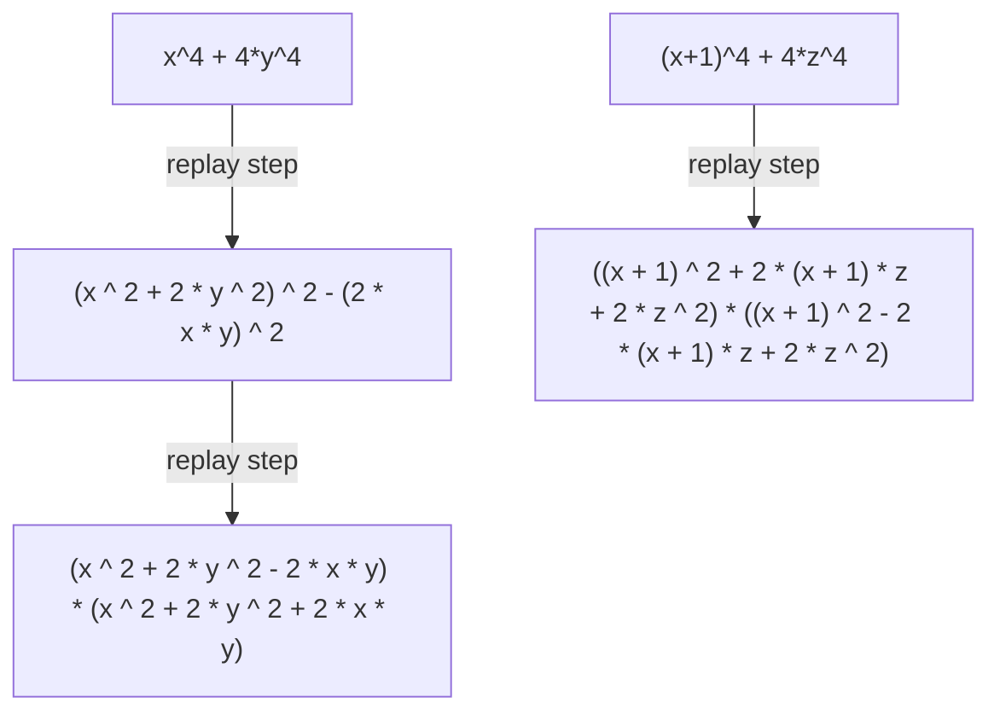

## Generated Discovery Gallery

### Sophie-Germain discovery replay

- input: `x^4 + 4*y^4`
- discovered bridge: `(x ^ 2 + 2 * y ^ 2) ^ 2 - (2 * x * y) ^ 2`
- factored output: `(x ^ 2 + 2 * y ^ 2 - 2 * x * y) * (x ^ 2 + 2 * y ^ 2 + 2 * x * y)`
- rules used: hypothesis_difference_of_squares_preparation -> ast_square_difference_factor
- proof/equivalence status: NO_COUNTEREXAMPLE_FOUND
- replay source: generated search/replay path in this report

### Learned Macro Reuse: Sophie-Germain

- input discovery: `(x+1)^4 + 4*z^4`
- learned macro: A^4 + 4*B^4 -> (A^2 + 2*A*B + 2*B^2)*(A^2 - 2*A*B + 2*B^2)
- learned/reused macro evidence: macro_6bd0496b
- validation examples: generated by the macro-learning/replay run
- supporting discovery path id: sophie-symbolic-real-hidden-structure-replay
- replay path: `(x+1)^4 + 4*z^4 -> ((x + 1) ^ 2 + 2 * (x + 1) * z + 2 * z ^ 2) * ((x + 1) ^ 2 - 2 * (x + 1) * z + 2 * z ^ 2)`

