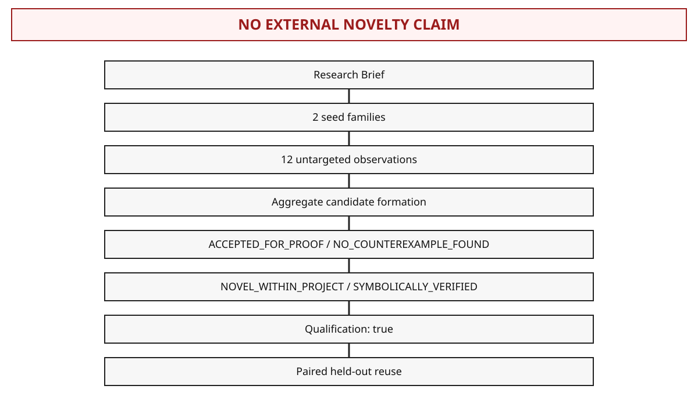
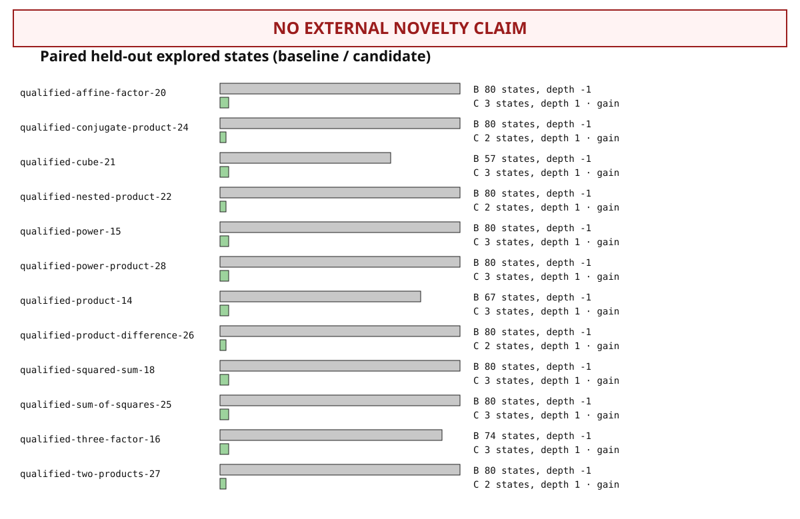
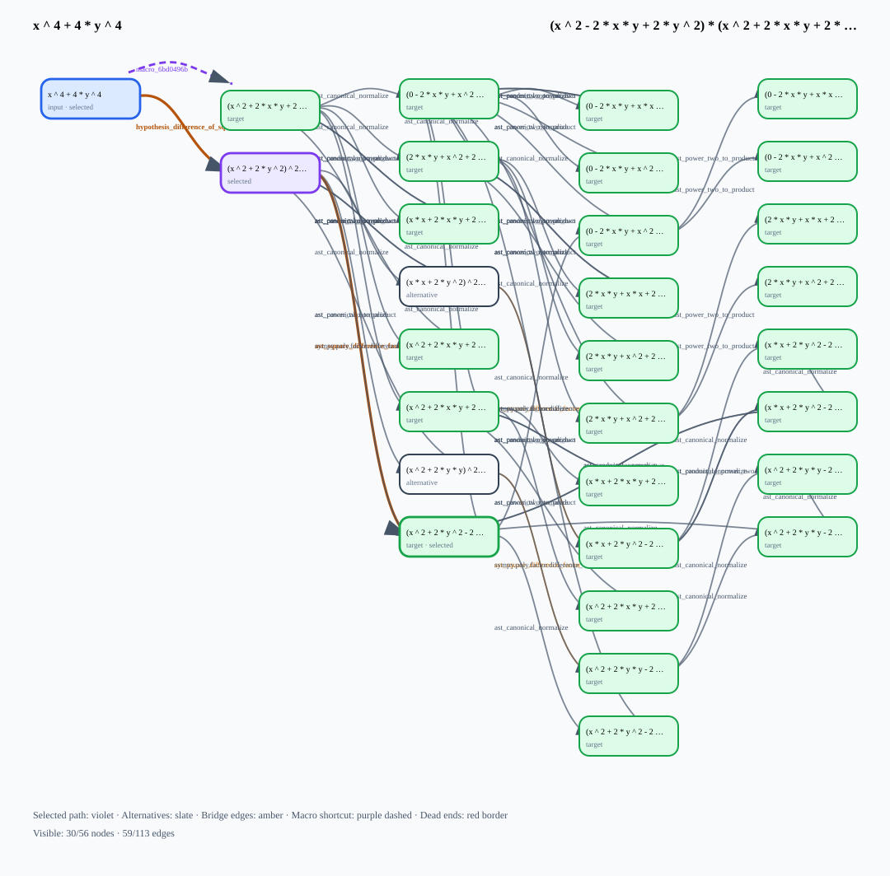

# Regelsuche Discovery Gallery

This gallery contains generated evidence only.

Public entries are admitted only after `PublicBenchmarkEvidenceGate` accepts their generated search evidence. Rejections are written to `generated/discovery/public-scenario-rejections.md`.

## Qualified autonomous discovery result card

This entry is generated by the supported one-command qualified production run.
It presents project evidence only and carries a visible
`NO EXTERNAL NOVELTY CLAIM` boundary.

```bash
./gradlew :regelsuche-release:runAutonomousDiscoveryWalkthrough
```

- [Walkthrough contract and container command](autonomous-discovery-walkthrough.md)
- [Result-card schema](schemas/regelsuche-autonomous-discovery-result-card-v1.schema.json)
- Generated sequence: [SVG](generated/autonomous-discovery-walkthrough/sequence.svg)
- Generated candidate lineage: [SVG](generated/autonomous-discovery-walkthrough/candidate-lineage.svg)
- Generated paired utility: [SVG](generated/autonomous-discovery-walkthrough/paired-utility.svg)
- Generated representative search: [SVG](generated/autonomous-discovery-walkthrough/representative-search.svg)





## Complete-square factorization

- Input: `x ^ 2 + 6 * x + 5`
- Target: `(x + 1) * (x + 5)`
- Evidence status: success
- Oracle status: `UNAVAILABLE`
- Bridge used: `complete_square_bridge`, `ast_square_difference_factor`
- Macro learned: `macro_3bbfed5b`
- Macro reused: `macro_3bbfed5b`
- Search-space excerpt: [SVG](generated/discovery/complete-square/search-space.svg)
- Evidence JSON link: [evidence.json](generated/discovery/complete-square/evidence.json)
- Canonical evidence ID: [`regelsuche.discovery-evidence/v1#sha256:217d5ca4dff3dba588f16d8451195a883378956a795259936317d3d35e8ce273`](generated/discovery/complete-square/evidence.json)


## Sophie-Germain discovery

- Input: `x ^ 4 + 4 * y ^ 4`
- Target: `(x ^ 2 - 2 * x * y + 2 * y ^ 2) * (x ^ 2 + 2 * x * y + 2 * y ^ 2)`
- Evidence status: success
- Oracle status: `UNAVAILABLE`
- Hidden bridge used: `hypothesis_difference_of_squares_preparation`, `ast_square_difference_factor`
- Macro learned: `macro_6bd0496b`
- Macro reused: `macro_6bd0496b`
- Search-space excerpt: [SVG](generated/discovery/sophie-germain/search-space.svg)
- Evidence JSON link: [evidence.json](generated/discovery/sophie-germain/evidence.json)
- Canonical evidence ID: [`regelsuche.discovery-evidence/v1#sha256:ad5a70e80124c9154f03c870b1f1b6d26fe482463eeb991d805f14eef38a1f31`](generated/discovery/sophie-germain/evidence.json)




## Scenario comparison

| Scenario | Success | Oracle | States | Edges | Bridge rules | Learned macros | Reused macros |
|---|---|---|---:|---:|---:|---:|---:|
| Complete-square factorization | yes | unavailable | 12 | 32 | 2 | 1 | 1 |
| Sophie-Germain hidden structure | yes | unavailable | 56 | 113 | 2 | 1 | 1 |

