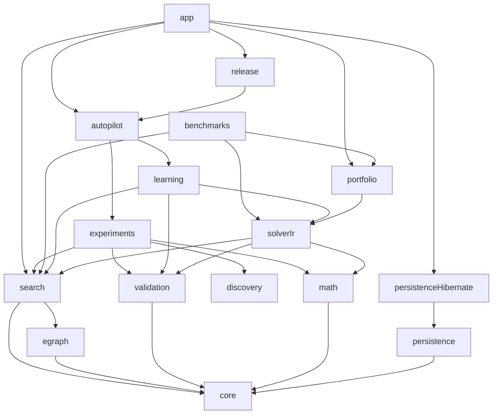

# Dependency-Regeln

Diese Regeln definieren die zulässigen Abhängigkeitsrichtungen zwischen den
Gradle-Modulen. In den folgenden Diagrammen bedeutet `A → B`: **A darf von B
abhängen**.

Die tatsächlichen Kanten werden durch die `build.gradle`-Dateien erzwungen.
Diese Seite erklärt die architektonische Absicht und die fachlichen Grenzen.

## Hauptrichtung



Das Diagramm zeigt die wesentlichen Schichtkanten, nicht jeden optionalen oder
rein testbezogenen Build-Eintrag.

## Verbindliche Modulregeln

### Innerer Kern

- `:regelsuche-core` besitzt keine Projektabhängigkeiten.
- Core enthält keine Hibernate-/JPA-, Web-, Docker-, Neo4j-, SymPy-, Z3- oder
  GraalVM-Prozessintegration.
- `:regelsuche-egraph` baut nur auf Core auf.
- `:regelsuche-search` verwendet Core und E-Graph; technische Persistenz- und
  Prozessadapter bleiben außerhalb.
- `:regelsuche-validation` definiert fachliche Validation-Verträge auf Basis
  des Core.

### Mathematische Algorithmen und Solver

- `:regelsuche-math-algorithms` enthält reine oder klar begrenzte mathematische
  Verfahren und keine Campaign-Entscheidungen.
- `:regelsuche-solver-ir` definiert Obligation, strukturierte Annahmen,
  Übersetzung, Resultat und Execution.
- `:regelsuche-solver-portfolio` darf Backends auswählen, budgetieren,
  ausführen und Konflikte berichten; es darf Resultate nicht semantisch
  umetikettieren.
- Ein Portfolio-, Planner- oder Benchmarkstatus ersetzt niemals die konkrete
  Solver Execution, die eine mathematische Aussage trägt.

### Learning, Discovery und Experimente

- `:regelsuche-learning` verwendet mathematische und Search-Verträge, kennt aber
  keine Web- oder App-Orchestrierung.
- `:regelsuche-discovery` enthält portable Domänen-, Pfad- und Handoff-Typen;
  konkrete Web- und Persistenzadapter bleiben außen.
- `:regelsuche-experiments` darf eingefrorene Inputs, Budgets, Runner und
  Evidence-DAGs verbinden, aber keine UI- oder Deploymentverantwortung
  übernehmen.
- `:regelsuche-autopilot` ist eine Composition-Schicht über Experiment- und
  Learning-Verträgen. Es darf die inneren Status- und Ressourcenbedeutungen
  nicht neu definieren.

### Persistenz

- `:regelsuche-persistence` enthält Ports, Konfiguration und leichtgewichtige
  Checkpoint-Typen ohne Hibernate, JPA oder Datenbanktreiber.
- `:regelsuche-persistence-hibernate` kapselt relationale Entities, Migration,
  Hibernate ORM/Search und PostgreSQL-Integration.
- Fachmodule dürfen nicht von der Hibernate-Implementierung abhängen.
- Abgeleitete Suchindizes sind keine Autorität für mathematische Evidence.

### CLI und Anwendung

- `:regelsuche-cli` bleibt frei von Fachmodulabhängigkeiten und stellt
  wiederverwendbare Parsing-/Command-Primitiven bereit.
- `:app` ist die äußere Composition Root und darf produktive Module verdrahten.
- `app` darf nicht als Ablage für neue Kernsemantik verwendet werden, wenn eine
  fachliche Capability-Grenze existiert.

## Solver-Invariante

Der autoritative Fluss lautet:

```text
Solver Obligation
  → Backend-spezifische Translation
  → Solver Result
  → Solver Execution
```

Ein Status wie `UNKNOWN`, `UNAVAILABLE`, Timeout oder technischer Fehler bleibt
von `CONFIRMED`, `REFUTED` oder formaler Proof-Evidence getrennt. Kein äußerer
Report darf diese Bedeutung überschreiben.

## Benchmark-Regeln

Vergleichende Benchmarks sind nach Capability und Informationsregime getrennt.
Ein Benchmark darf:

- Suchstrategien unter identischen Inputs, Targets, Inventaren und Budgets
  ausführen;
- externe CAS-, SMT- oder Prover-Adapter auf einem ausdrücklich gemeinsamen
  Fragment vergleichen;
- Wandzeit und Durchsatz als nichtkanonische Diagnostik erfassen;
- ungemessene oder unsupported Bereiche als Coverage Gaps retainen.

Ein Benchmark darf nicht:

- zielgerichtete Suche und targetfreie Discovery in einem Score vermischen;
- Validation als Candidate Formation zählen;
- Search-Erfolg als Proof darstellen;
- fehlende, übersprungene, unsupported oder inconclusive Fälle entfernen;
- Qualification-, TEST-, Review- oder Hidden-Reference-Informationen entgegen
  dem Parity Manifest verwenden;
- eine zweite, permissivere Ergebnissemantik neben dem autoritativen Vertrag
  pflegen.

Die verbindliche Score-Policy lautet:

```text
NO_UNIVERSAL_SCORE_TRACK_SCOPED_CLAIMS_ONLY
```

## Evidence- und Claim-Regel

Abhängigkeiten dürfen keine unzulässige Informationsrückkopplung erzeugen.
Insbesondere:

- Candidate Formation erhält keine FINAL-TEST-Ziele oder -Ergebnisse;
- Validatoren und Prover beurteilen vorhandene Kandidaten und erzeugen nicht
  verdeckt die zu bewertende Hypothese;
- externe Novelty-Recherche beginnt erst nach dem Einfrieren des Kandidaten;
- Promotion und Public Evidence lesen qualifizierte Upstream-Evidence, ändern
  sie aber nicht;
- Laufzeitdiagnostik darf kanonische Work-Zähler nicht ersetzen.

## Infrastrukturregel

Technische Adapter liegen außerhalb der mathematischen Grundlage:

- HTTP und UI in `app`;
- Hibernate/JPA in `:regelsuche-persistence-hibernate`;
- externe Prozessadapter in Solver-, Benchmark- oder App-Schichten;
- Docker- und Testcontainers-Wiring in äußeren Modulen und Testquellen;
- GitHub Actions ausschließlich als Plattformadapter.

Eine Infrastrukturabhängigkeit im Core oder Search-Modul benötigt eine
Architekturentscheidung und ist standardmäßig abzulehnen.

## Interface-first für neue Capabilities

Größere Erweiterungen beginnen mit einem stabilen Port oder Vertrag. Vor einer
neuen Implementierung sind mindestens zu klären:

1. fachliche Verantwortung;
2. unterstützte Inputs und Terminalzustände;
3. Budget- und Fehlersemantik;
4. kanonische Identität und Evidence-Auswirkungen;
5. zulässige Dependency-Richtung;
6. Test- und Migrationsstrategie.

Beispiele bestehender Portfamilien sind Regelindex, Search Trace Store,
Counterexample Search, Polynomial Equivalence, Completion, Critical Pairs,
Numeric Relations, Hypothesis Repository und Discovery Experiment Runner.

## Prüfung bei Änderungen

Bei jeder neuen Modulabhängigkeit ist zu prüfen:

- Entsteht ein Zyklus oder eine Rückabhängigkeit in eine innere Schicht?
- Wird eine Technologieabhängigkeit in ein Fachmodul gezogen?
- Verändert die Kante Informationszugriff oder Claim-Autorität?
- Kann ein Port die Abhängigkeit umkehren?
- Sind Modulstruktur, Architektur und Tests aktualisiert?

Eine rein bequeme Zugriffsmöglichkeit ist keine ausreichende Begründung für
eine neue Kante.
