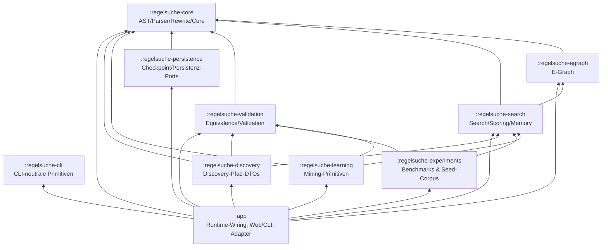

# Architektur

Regelsuche ist jetzt ein Gradle-Multi-Projekt. Die ersten physischen Grenzen
sind dort gezogen, wo der aktuelle Code bereits azyklisch und stabil genug ist:

- `regelsuche-core` enthält den mathematischen Kern ohne Neo4j/GraalVM/Web/Testcontainer-Abhängigkeiten.
- `regelsuche-egraph` hängt nur vom Core ab.
- `regelsuche-search` enthält Suchprofile, Strategien, CostModels und die TranspositionTable-Abstraktion ohne JSON-/Neo4j-Persistenzadapter.
- `regelsuche-validation` hängt vom Core ab und kapselt die aktuellen Validierungs-/Äquivalenzadapter sowie den gemeinsamen `CandidateProofStatus`.
- `regelsuche-persistence` enthält persistence-nahe Konfiguration und checkpointfähige JSON-/In-Memory-Ports ohne Datenbanktreiber.
- `regelsuche-learning` enthält portable Mining-/Anti-Unification-Primitiven und Learning-Ports ohne Web-, CLI- oder Graph-Orchestrierung.
- `regelsuche-experiments` enthält Benchmark-/Experiment-Primitiven und den Seed-Corpus-Generator ohne Web-, CLI- oder Persistenzadapter.
- `regelsuche-cli` enthält CLI-neutrale Command-/Options-Primitiven ohne App- oder Web-Wiring.
- `regelsuche-discovery` enthält portable Discovery-Pfad-DTOs ohne Graph-/Export-/App-Orchestrierung.
- `app` bleibt die Laufzeit-Hülle für CLI, Web, Persistence, Learning/Discovery und die noch zyklisch gekoppelten oberen Schichten.

Damit ist Issue #41 nicht mehr nur dokumentiert: Gradle erzwingt die wichtigsten
Grenzen bereits beim Kompilieren.

## Architekturdiagramm

## Architektur-Leitplanken

- mathematischer Kern bleibt technologie-agnostisch,
- E-Graph, Search, Validation, Persistence, Learning, Experiments und Discovery benutzen Core-/Search-Typen über explizite Projektabhängigkeiten; CLI bleibt projektabhängigkeitsfrei,
- Infrastruktur bleibt in `app` bzw. in Adapter-Modulen,
- neue große Komponenten bekommen zuerst stabile Interfaces,
- Tests sind nach Modul und Laufzeit/Kosten geschichtet.

## Modulstruktur

Die Zielstruktur und aktuelle Paket-Zuordnung steht in
[module-structure.md](module-structure.md).

## Abhängigkeitsregeln

Die verbindlichen Richtungen und verbotenen Kanten stehen in
[dependency-rules.md](dependency-rules.md).

## Test-Schichtung

Die Teststrategie inkl. schneller Core-Tests, Integrations- und Browser-E2E
steht in [testing-strategy.md](testing-strategy.md).

## ADRs

Architekturentscheidungen werden unter [`docs/adr/`](adr/) versioniert.
