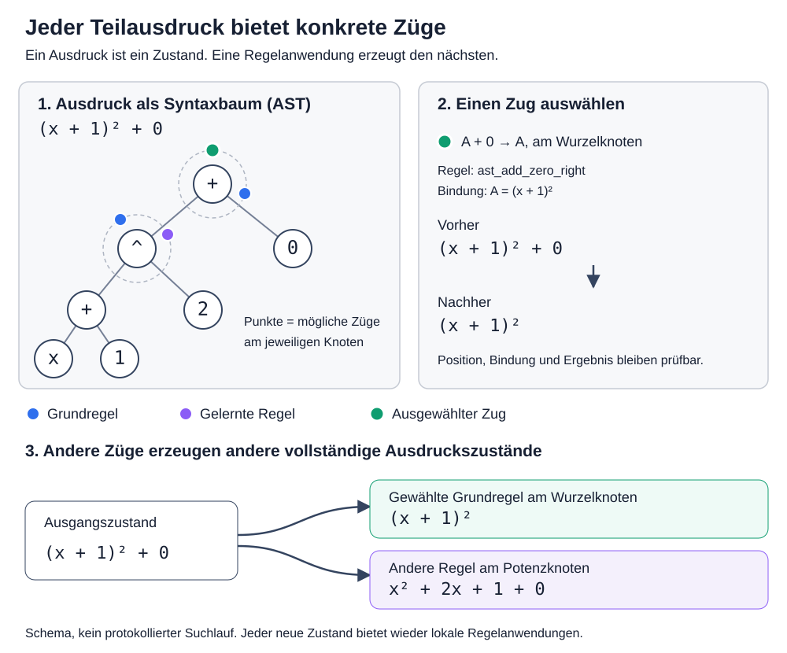

# AST-Regelradar: Wie Regelsuche einen Ausdruck untersucht

- Status: Architektur- und Visualisierungsentwurf
- Geltungsbereich: Ausdrucks-AST, lokale Regelanwendungen, gelernte Makroregeln und globaler Suchgraph
- Abgrenzung: Diese Seite beschreibt sowohl den bereits vorhandenen Kern als auch die noch fehlende einheitliche Visualisierungsschicht. Abweichungen sind ausdrücklich als Zielbild markiert.

## Kernaussage

Regelsuche betrachtet einen mathematischen Ausdruck nicht als Zeichenkette, sondern als
**abstrakten Syntaxbaum (AST)**.

Jeder AST-Knoten bezeichnet einen Teilausdruck. An jeder Baumposition wird unabhängig
ermittelt, welche konkreten Umformungen dort im aktuellen Zustand ausführbar sind.
Diese Anwendungen können als gleichmäßig verteilte Punkte auf einem Kreis um den
Knoten dargestellt werden.

Ein Punkt bedeutet daher nicht nur „diese Regel existiert“, sondern:

> **Diese konkrete Regel kann mit diesen Bindungen, Annahmen und dieser Herkunft an
> genau dieser Baumposition angewendet werden und würde den angezeigten vollständigen
> Folgeausdruck erzeugen.**



## Zwei verschiedene Graphen

Für das Verständnis müssen zwei Ebenen getrennt werden.

### 1. Der AST eines einzelnen Ausdruckszustands

Der Ausdruck

```text
(x + 1)^2 + 0
```

besteht beispielsweise aus einem Wurzelknoten `+`, dessen linkes Kind der
Potenzknoten `(x + 1)^2` und dessen rechtes Kind die Konstante `0` ist.

Dieser Baum zeigt **eine Position im mathematischen Spiel**.

### 2. Der Suchgraph aus vollständigen Ausdruckszuständen

Wird an einer AST-Position eine Regel angewendet, ersetzt Regelsuche den betroffenen
Teilbaum, baut den unveränderten Rest des Ausdrucks wieder auf und erhält einen neuen
vollständigen Ausdruck.

```text
E0 = (x + 1)^2 + 0
  -- ast_add_zero_right @ root -->
E1 = (x + 1)^2
```

`E0` und `E1` sind Knoten im globalen Suchgraphen. Die angewandte lokale Umformung ist
die gerichtete Kante zwischen ihnen.

Der vorhandene Suchgraph und das vorgeschlagene AST-Regelradar konkurrieren daher
nicht miteinander:

- Das **AST-Regelradar** erklärt, welche nächsten Züge innerhalb eines Zustands möglich
  sind.
- Der **Suchgraph** zeigt, welche vollständigen Zustände durch tatsächlich untersuchte
  Züge entstanden sind.

## Was der Kreis um einen AST-Knoten bedeutet

Der Kreis ist eine visuelle Trägerfläche für die endliche Kandidatenmenge an genau
einer `TreePosition`.

Die Punkte werden deterministisch sortiert und gleichmäßig auf dem Kreis verteilt.
Die Reihenfolge darf nicht vom zufälligen Iterationsverhalten einer Collection
abhängen. Eine geeignete Sortierung ist beispielsweise:

1. Regelherkunft,
2. Regel-ID,
3. kanonische Bindungen,
4. Annahmen,
5. kanonischer Folgeausdruck.

Der Kreis selbst ist keine zusätzliche mathematische Struktur. Er macht lediglich
die lokale Verzweigung sichtbar.

### Ein Punkt ist eine konkrete Anwendung

Eine abstrakte Regel kann an derselben Position mehrere konkrete Anwendungen liefern.
Beispielsweise kann eine parametrisierte Regel unterschiedliche Terme oder
Substitutionen binden. Deshalb ist die richtige Zähleinheit nicht `RewriteRule`,
sondern eine ausführbare Regelanwendung.

Das Zielmodell ist sinngemäß:

```java
record ApplicableMove(
    TreePosition position,
    String ruleId,
    RuleOrigin origin,
    Map<String, String> bindings,
    List<String> assumptions,
    String subtreeBefore,
    String subtreeAfter,
    String expressionAfter,
    ValidationStatus validationStatus,
    Optional<MacroMoveExpansion> macroExpansion
) {}
```

Die konkrete API kann anders heißen. Entscheidend ist, dass Visualisierung, Suche,
Replay und Export dieselbe semantische Einheit verwenden.

## Regelherkünfte

Die an einem Knoten sichtbare Kandidatenmenge ist die Vereinigung aller **aktiven und
für diese Position passenden** Regelquellen.

### Atomare Grundregeln

Das sind die kleinen, vorgegebenen Umformungen des mathematischen Kerns, zum Beispiel:

- `A + 0 → A`,
- `A * 1 → A`,
- `A^2 → A * A`,
- Distributivregeln,
- Faktorisierung gemeinsamer Faktoren,
- domänenspezifische sichere Schritte.

Sie bilden das elementare Zugrepertoire. Komplexere Schulbuchidentitäten sollen nicht
notwendig als einzelne hart codierte Regeln vorliegen, sondern können als Pfade aus
diesen atomaren Zügen entstehen.

### Deklarative und erweiterte Regeln

Zusätzliche Regeln können aus aktivierten Regeldateien, Knowledge Packs oder Plugins
kommen. Für das Regelradar müssen sie dieselben Metadaten liefern wie eingebaute
Regeln: Herkunft, ID, Bindungen, Annahmen, Vorschau und Vertrauensstatus.

### Gelernte und promovierte Makroregeln

Ein wiederholt erfolgreicher Pfad aus atomaren Regeln kann generalisiert, validiert
und als `ReusableRule` promoviert werden. Danach kann er wie ein einzelner Zug in die
Suche eingespeist werden.

Im Regelradar erhält eine solche Anwendung einen eigenen Punkt. Der Punkt muss jedoch
aufklappbar bleiben: Eine Makroregel ersetzt die atomare Herleitung nicht, sondern
komprimiert sie. `MacroMoveExpansion` bewahrt den ursprünglichen Pfad für Replay und
Audit.

Nicht jeder geminte Kandidat darf erscheinen. Sichtbar als ausführbarer Zug werden
nur Regeln, die die jeweils geltenden Aktivierungs-, Vertrauens-, Annahme- und
Validierungsgates passiert haben.

## Der vollständige Ablauf

### Schritt 1: Ausdruck parsen

Der Eingabetext wird einmal in einen unveränderlichen AST überführt. Jeder Knoten ist
über einen stabilen Pfad erreichbar, beispielsweise `root`, `0`, `0.1` oder den
kanonisch formatierten `pathKey`.

### Schritt 2: Alle Baumpositionen besuchen

Regelsuche durchläuft den AST deterministisch. Für jede Position werden der Teilbaum
und seine Position gemeinsam betrachtet.

Der vorhandene [`TreeLocalMoveEnumerator`](../app/src/main/java/de/regelsuche/moves/enumerate/TreeLocalMoveEnumerator.java)
setzt dieses Grundprinzip bereits um: Er besucht jeden Teilbaum, enumeriert dort
endliche Kandidaten und versieht sie mit einer `TreePosition`.

### Schritt 3: Kandidaten aus allen aktiven Regelquellen bilden

Für den Teilbaum werden Grundregeln, aktivierte Erweiterungsregeln und qualifizierte
gelernte Regeln auf strukturelles Matching geprüft.

Dabei gilt:

- Eine Regel, die nicht zum Teilbaum passt, erzeugt keinen Punkt.
- Eine Regel mit mehreren zulässigen Bindungen kann mehrere Punkte erzeugen.
- Annahmen gehören zum Kandidaten und dürfen nicht verborgen werden.
- Budgets begrenzen die Anzahl generierter Kandidaten reproduzierbar.

### Schritt 4: Vorschau berechnen

Für jeden Kandidaten wird der lokale Teilbaum probeweise ersetzt. Daraus entstehen:

- `subtreeBefore`,
- `subtreeAfter`,
- der vollständige `expressionAfter`.

Der vorhandene `LocalRewriteApplier` und der
[`RuleInspectionService`](../app/src/main/java/de/regelsuche/ide/RuleInspectionService.java)
bilden diesen Pfad bereits ab. `RuleInspectionService` gruppiert Treffer nach
Baumposition und liefert Bindungen sowie Vorher-/Nachher-Vorschauen.

### Schritt 5: Kandidaten bewerten

Die Suchstrategie entscheidet nicht allein nach der Zahl der Punkte. Sie kann unter
anderem berücksichtigen:

- Suchprofil und Ziel,
- geschätzte Kostenänderung,
- AST-Wachstum,
- didaktische Qualität,
- Proof- und Validation-Status,
- bereits besuchte kanonische Zustände,
- Neuheit der Regelkombination,
- Makro-Confidence und Zielrelevanz,
- globale Zustands- und Tiefenbudgets.

Das Regelradar soll diese Bewertung sichtbar machen, aber nicht mit der bloßen
Anwendbarkeit verwechseln. Ein Punkt kann anwendbar sein und trotzdem wegen Budget,
Ranking oder Duplikaterkennung nicht expandiert werden.

### Schritt 6: Einen lokalen Zug anwenden

Wählt die Suche einen Punkt, wird nur der adressierte Teilbaum ersetzt. Da der AST
unveränderlich ist, werden die Eltern auf dem Weg zur Wurzel neu aufgebaut; alle
anderen Teilbäume bleiben semantisch unverändert.

Das Ergebnis ist wieder ein vollständiger Ausdruckszustand.

### Schritt 7: Kanonisieren, validieren und deduplizieren

Vor der Aufnahme in den Suchgraphen wird der Folgeausdruck kanonisiert. Bereits
bekannte gleichwertige Zustände können verworfen oder mit der besseren Herleitung
zusammengeführt werden.

Zusätzlich bleiben folgende Informationen an der Kante erhalten:

- betroffene Baumposition,
- Regel-ID und Herkunft,
- Bindungen und Annahmen,
- lokaler Vorher-/Nachher-Teilbaum,
- vollständiger Vorher-/Nachher-Ausdruck,
- Validierungs- oder Proof-Status,
- bei Makros die expandierbare atomare Herleitung.

### Schritt 8: Vorgang rekursiv wiederholen

Jeder neue Ausdruckszustand besitzt einen neuen AST und damit ein neues lokales
Regelradar. Die Suche wiederholt denselben Zyklus, bis Ziel, Sättigung oder Budgetgrenze
erreicht ist.

## Beispiel

Für

```text
(x + 1)^2 + 0
```

könnten unter einem passenden aktiven Regelbestand unter anderem folgende konkrete
Anwendungen entstehen:

| Position | Teilbaum | Herkunft | konkrete Anwendung | Folgeausdruck |
|---|---|---|---|---|
| `root` | `(x + 1)^2 + 0` | Grundregel | `ast_add_zero_right` mit `A=(x+1)^2` | `(x + 1)^2` |
| `0` | `(x + 1)^2` | Grundregel | `ast_power_two_to_product` mit `A=x+1` | `(x + 1)*(x + 1) + 0` |
| `0` | `(x + 1)^2` | gelernte Makroregel | `macro_binomial_square` mit `A=x`, `B=1` | `x^2 + 2*x + 1 + 0` |

Die drei Tabellenzeilen entsprechen drei Punkten an zwei verschiedenen AST-Knoten.
Dass zwei Punkte am Potenzknoten liegen, bedeutet: Von derselben Baumposition führen
zwei unterschiedliche legale Züge zu zwei unterschiedlichen vollständigen
Folgezuständen.

## Was heute bereits vorhanden ist

| Erforderliche Fähigkeit | Vorhandene Implementierung | Status |
|---|---|---|
| Ausdruck als AST parsen und formatieren | `ExpressionParser`, `Expr`, `ExpressionFormatter` | vorhanden |
| Regeln rekursiv an allen Teilbäumen anwenden | [`AstRewriteTransformationEngine`](../regelsuche-core/src/main/java/de/regelsuche/transform/AstRewriteTransformationEngine.java) | vorhanden |
| Positionen explizit enumerieren | `TreeLocalMoveEnumerator`, `TreePosition` | vorhanden |
| lokale Kandidaten mit Bindungen und Vorschau inspizieren | `RuleInspectionService`, `RuleInspectionDto` | vorhanden |
| lokalen Teilbaum ersetzen und vollständigen Ausdruck erzeugen | `LocalRewriteApplier` | vorhanden |
| begrenzte Suche über vollständige Zustände | [`CountableMoveSearchEngine`](../app/src/main/java/de/regelsuche/moves/search/CountableMoveSearchEngine.java) und weitere Strategien | vorhanden |
| gelernte Regeln als ausführbare Suchzüge verwenden | [`MacroMoveTransformationEngine`](../app/src/main/java/de/regelsuche/mining/MacroMoveTransformationEngine.java) | vorhanden |
| atomaren Makropfad für Replay bewahren | `MacroMoveExpansion` | vorhanden |
| AST-Knoten mit einem einheitlichen Regelkreis visualisieren | noch keine gemeinsame produktive Ansicht | fehlt |
| Grund-, Plugin- und Makroregeln in einem positionsbezogenen Visualisierungs-DTO vereinigen | derzeit mehrere vorhandene Pfade und DTOs | teilweise |
| Auswahl-, Pruning- und Ausführungsstatus jedes Punkts live darstellen | Suchmetriken vorhanden, aber nicht an ein AST-Regelradar gebunden | fehlt |

## Zielarchitektur der Visualisierung

Die Visualisierung sollte keine eigene Mathematik- oder Matchinglogik enthalten. Sie
konsumiert ein Backend-Modell, das aus den bestehenden Rewrite-, Inspection-, Search-
und Macro-Komponenten zusammengesetzt wird.

```text
aktive Regelquellen
  ├─ atomare Core-Regeln
  ├─ Regeldateien / Knowledge Packs / Plugins
  └─ validierte ReusableRules
          │
          v
PositionAwareMoveCatalog
          │  inspect(expression, searchContext)
          v
AstRuleRadarDto
  ├─ AST-Knoten mit TreePosition
  ├─ konkrete ApplicableMoves pro Knoten
  └─ Status: available / selected / applied / pruned / duplicate / rejected
          │
          ├─ Web-Visualisierung
          ├─ Search-Successor-Generator
          ├─ Replay
          └─ Export / Accessibility
```

Der neue Integrationspunkt sollte bestehende Komponenten adaptieren, nicht parallel
neu implementieren.

## Interaktion in der Weboberfläche

Eine geeignete erste produktive Ansicht besitzt folgende Eigenschaften:

1. Der Ausdruck wird als zoombarer Baum gezeigt.
2. Jeder Knoten besitzt einen Regelkreis; bei vielen Kandidaten wird geclustert oder
   aufgefächert, ohne die tatsächliche Anzahl zu verfälschen.
3. Hover oder Tastaturfokus auf einem Punkt zeigt Regelname, Herkunft, Bindungen,
   Annahmen, lokalen Rewrite und vollständigen Folgeausdruck.
4. Ein Klick wählt den Zug nur zur Vorschau. Eine getrennte Aktion führt ihn aus oder
   setzt ihn als nächsten Suchschritt.
5. Grundregeln, gelernte Regeln und Erweiterungsregeln sind visuell unterscheidbar;
   Farbe allein darf wegen Barrierefreiheit nicht die einzige Codierung sein.
6. Angewandte, verworfene, wegen Duplikat geprunte und wegen Annahmen abgelehnte
   Kandidaten erhalten unterschiedliche Zustände.
7. Eine Makroregel lässt sich zu ihren atomaren Schritten aufklappen.
8. Der Wechsel zwischen AST-Regelradar und globalem Suchgraph behält die ausgewählte
   Suchkante und `TreePosition` bei.

## Invarianten

Die Darstellung muss folgende fachliche Aussagen bewahren:

- Ein AST-Knoten ist ein Teilausdruck, kein Suchzustand.
- Ein Punkt ist eine konkrete Anwendung, kein bloßer Regelname.
- Nur tatsächlich passende Regeln erscheinen als anwendbar.
- Ein lokal angewandter Zug erzeugt immer einen vollständigen Folgeausdruck.
- Die Baumposition ist Teil der Identität der Anwendung.
- Gelernte Regeln durchlaufen dieselben Anwendbarkeits- und Sicherheitsgrenzen wie
  andere Regeln und behalten zusätzliche Herkunfts- und Evidence-Metadaten.
- Pruning ist keine mathematische Widerlegung der Regel.
- Eine erfolgreiche Transformation ist noch kein formaler Beweis; der ausgewiesene
  Proof- beziehungsweise Validation-Status bleibt maßgeblich.
- Visualisierung und Suche müssen dieselbe deterministische Kandidatenmenge verwenden.

## Warum die Züge abzählbar sind

Der mathematische Gesamtraum kann unendlich sein. Für einen konkreten Zustand wird die
nächste Verzweigung dennoch endlich und reproduzierbar gemacht:

- Der aktuelle AST besitzt endlich viele Knoten.
- Der aktive Regelbestand ist für einen Lauf eingefroren und endlich.
- Parameterenumeratoren arbeiten mit expliziten Grenzen.
- Wachstums-, Kandidaten-, Zustands- und Tiefenbudgets begrenzen Expansionen.
- Die Kandidaten werden deterministisch sortiert und kanonisch dedupliziert.

Damit ist der Kreis um einen Knoten nicht nur eine Metapher. Er visualisiert die im
aktuellen Suchkontext tatsächlich enumerierte, endliche Menge möglicher nächster
lokaler Züge.

## Nicht-Ziele

- Der Kreis behauptet nicht, alle mathematisch denkbaren Umformungen zu enthalten.
- Die Punktzahl ist kein Qualitätsmaß für einen Ausdruck.
- Ein gelernter Makrozug ersetzt keinen Beweis und keine atomare Replay-Herleitung.
- Die AST-Ansicht ersetzt weder E-Graph noch globalen Suchgraph.
- Die UI darf keine eigenen, vom Backend abweichenden Regelmatches berechnen.

## Empfohlene Umsetzungsschritte

1. Ein kanonisches `ApplicableMove`-/`AstRuleRadarDto`-Modell definieren.
2. `RuleInspectionService`, `AstRewriteTransformationEngine` und
   `MacroMoveTransformationEngine` über Adapter in einem positionsbezogenen Katalog
   zusammenführen.
3. Auswahl- und Pruningereignisse aus der Suche mit stabilen Kandidaten-IDs verknüpfen.
4. Einen read-only API-Endpunkt für AST plus Regelradar bereitstellen.
5. Die Baumansicht mit Tastatursteuerung, Textalternative und deterministischem Layout
   implementieren.
6. Vorschau und manuelle Anwendung an denselben lokalen Rewrite-Pfad anbinden, den auch
   die Suche verwendet.
7. Replay und globalen Suchgraph bidirektional mit `TreePosition` und Kandidaten-ID
   verknüpfen.
8. Screenshot-, DTO-, Determinismus- und Accessibility-Tests ergänzen.

## Verwandte Dokumentation

- [Architektur](architecture.md)
- [Search Intelligence](search-intelligence.md)
- [Makroregeln](macro-rules.md)
- [Design: Local Rewrite API](design/local-rewrite.md)
- [Local Rewrite Search Integration](design/local-rewrite-search-integration.md)
- [TreePosition ADR](adr/tree-position.md)
