# Demo-Gallery

**Regelsuche macht mathematische Umformungen als Suchraum sichtbar.**
Knoten sind Ausdrücke, Kanten sind Umformungen, Pfade sind Rechenwege —
und jede Demo erzählt eine kleine Geschichte darüber, wie aus einer
Eingabe ein Ergebnis wird.

Diese Seite ist als **geführte Produktdemo** aufgebaut, nicht als
Asset-Liste. Jede Demo unten wird von einem **echten Playwright-Browsertest**
abgenommen, der denselben Screenshot erzeugt. So bleibt die Doku immer
aktuell — wenn die Funktion bricht, fällt der Screenshot weg, weil der
Test rot wird.

> **Hinweis zu Screenshots:** Die Bilder werden im Documentation
> Screenshot Mode als gezielte Container-Shots aufgenommen. Graphbilder
> müssen Cytoscape plus KaTeX-Overlay zeigen; Full-Page-Fallbacks werden
> nicht in die Dokumentation übernommen.

Aktualisieren der Gallery:

```bash
./gradlew e2eTest -Pregelsuche.recordDocs=true
```

## Empfohlene Tour

In dieser Reihenfolge erschließt sich der Funktionsumfang am schnellsten:

1. [Binomische Formel](#binomische-formel) — der „Hello World“ der Suche.
2. [Bruchkürzung mit Annahme `x ≠ 0`](#bruchkürzung-mit-annahme-x--0) —
   warum Annahmen sichtbar bleiben müssen.
3. [Ungleichung mit Vorzeichen-Flip](#ungleichung-mit-vorzeichen-flip) —
   der kritische Schritt wird hervorgehoben.
4. [Makroregel-Lernen](#makroregel-lernen) — wie das System eigene
   Abkürzungen aufbaut.
5. [Proof-Job-Panel](#proof-job-panel--a--0--a) — von der Regel zum
   formalen Beweis.
6. [Export-Bundle](#export-bundle) — den Rechenweg außerhalb der App
   nutzen.

Die übrigen Demos (Trigonometrie, Polynom-Expansion, Lineare Gleichung,
Ableitung, Matrix-Distributivität, Proof-Bridge) vertiefen einzelne
Aspekte und sind unten ebenfalls dokumentiert.

## Was jede Demo zeigt

Jede Demo folgt derselben klaren Struktur. Leere Abschnitte werden
weggelassen, damit nichts „rauschen“ erzeugt.

- **Eingabe** — der Ausdruck und das Ziel der Suche.
- **Ergebnis** — was am Ende sichtbar wird.
- **Rechenweg** — die Schritte, die das System gewählt hat.
- **Verwendete Regeln** — die Regeln, die in diesem Rechenweg
  tatsächlich angewendet wurden. Globale, im System bekannte Muster
  erscheinen **nicht** hier, sondern ausschließlich im
  *Suchgedächtnis → Universelle Muster*.
- **Annahmen** — Voraussetzungen, unter denen das Ergebnis gilt
  (z. B. $x \neq 0$).
- **Proof-Status** — ob und wie das Ergebnis formal abgesichert ist.
- **Export** — wie der Rechenweg weitergenutzt werden kann.
- **Warum ist das interessant?** — eine kurze Produktstory pro Demo.

## Glossar

Kurze Erklärungen für die Begriffe, die in den Demos auftauchen:

- **Makroregel** — eine wiederverwendbare Umformungsfolge, die das
  System aus mehreren Beispielen gelernt hat. Sie wirkt wie eine
  Abkürzung für künftige Suchen.
- **Suchgraph** — die Karte aller Ausdrücke und Umformungen, die in
  einer Suche besucht wurden.
- **Replay** — der gewählte Rechenweg wird Schritt für Schritt
  abgespielt, mit Erklärung pro Schritt.
- **Proof-Status** — sagt, wie sicher eine Umformung ist: nur
  beobachtet, an Beispielen getestet, symbolisch geprüft oder vom
  Beweiser formal bestätigt.
- **Universelle Muster** — häufig wiederkehrende mathematische
  Strukturen aus mehreren Suchläufen. Diese Muster stammen nicht aus
  einer einzelnen Demo und sind nicht notwendigerweise Teil der
  aktuellen Demo.
- **Equality Saturation** — ein Suchverfahren, das viele äquivalente
  Formen eines Ausdrucks gleichzeitig betrachtet, statt einen einzelnen
  Pfad zu raten.
- **Suchgedächtnis** — die persistente Sammlung von Regeln und
  Mustern, die das System über viele Suchen hinweg aufbaut.

Diese Begriffe werden in der UI zusätzlich als Tooltips angeboten
(siehe `docs/web-ui-user-guide.md`).

---

## Binomische Formel


*Der Screenshot zeigt den auf den besten Rechenweg gefilterten Graphen
von $(x+3)^2$ zum vollständig ausmultiplizierten Polynom.*

**Eingabe** — Anzeigeform:

$$
(x + 3)^2
$$

Technische Eingabe:

```text
(x+3)^2
```
**Ergebnis** — Anzeigeform:

$$
x^2 + 6x + 9
$$
**Rechenweg**:

$$
\begin{aligned}
(x+3)^2
&\rightarrow x(x+3) + 3(x+3) \\
&\rightarrow x^2 + 3x + 3x + 9 \\
&\rightarrow x^2 + 6x + 9
\end{aligned}
$$
- **Verwendete Regeln** — Distributivgesetz und Zusammenfassen
  gleichartiger Terme (jeweils mehrfach im Replay angewendet).
- **Annahmen** — keine.
- **Proof-Status** — symbolisch geprüft.
- **Export** — `GET /api/exports/bundle.zip` nach Demo-Klick.

### Warum ist das interessant?

Das System zeigt nicht nur das Ergebnis, sondern den Weg: Potenz
auflösen, ausmultiplizieren, gleiche Terme zusammenfassen. Genau
dieser Weg ist das, was im Unterricht zählt.

| Aspekt | Wert |
| --- | --- |
| Demo-ID | `binomial` |
| Test | `binomialDemoBrowserFlow()` |

---

## Bruchkürzung mit Annahme `x ≠ 0`

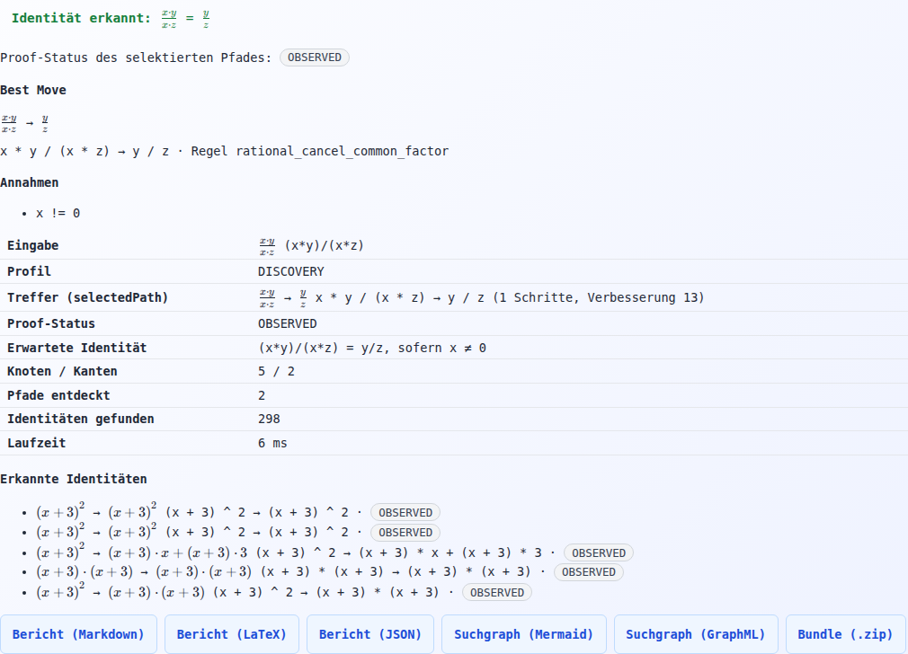

*Der Screenshot zeigt die Demo-Summary-Karte mit Trefferzeile und der
sichtbaren Annahme $x \neq 0$, unter der die Kürzung gültig ist.*

**Eingabe** — Anzeigeform:

$$
\frac{x \cdot y}{x \cdot z}
$$

Technische Eingabe:

```text
(x*y)/(x*z)
```
**Ergebnis** — Anzeigeform:

$$
\frac{x y}{x z} \rightarrow \frac{y}{z}
\qquad \text{unter der Annahme } x \neq 0
$$
- **Rechenweg** — Kürzen des gemeinsamen Faktors $x$ aus Zähler und
  Nenner.
- **Verwendete Regeln** — Faktorisieren, Kürzen unter Annahme.
**Annahmen** —

$$
x \neq 0
$$

(wird im Summary-Panel sichtbar ausgewiesen).
- **Proof-Status** — symbolisch geprüft, unter angegebener Annahme.

### Warum ist das interessant?

Das System kürzt nur unter der **sichtbaren** Annahme $x \neq 0$. So
bleibt der mathematische Sicherheitsabstand zwischen „algebraisch
hübsch“ und „in allen Fällen erlaubt“ erhalten.

| Aspekt | Wert |
| --- | --- |
| Demo-ID | `rational` |
| Test | `rationalDemoBrowserFlow()` |

---

## Ungleichung mit Vorzeichen-Flip

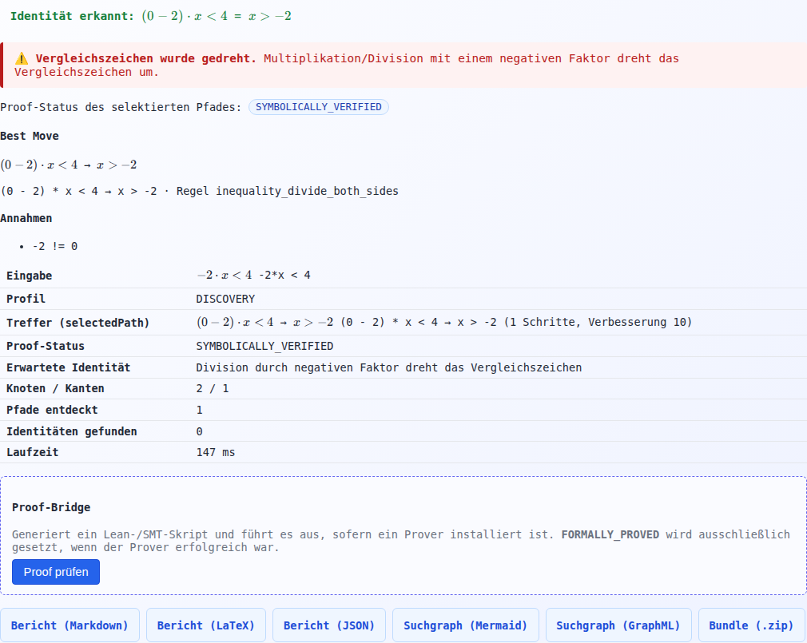

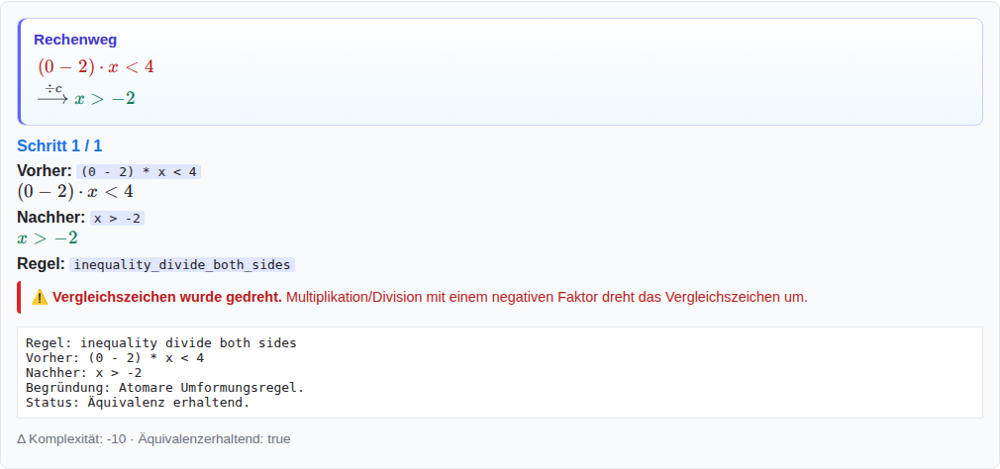

*Der erste Screenshot zeigt eine Warnkarte, die erklärt, warum das
Vergleichszeichen kippt; der zweite zeigt die Replay-Karte, in der
genau dieser Schritt rot markiert ist.*

**Eingabe** — Anzeigeform:

$$
-2x < 4
$$

Technische Eingabe:

```text
-2*x < 4
```
**Ergebnis** — Anzeigeform:

$$
-2x < 4 \rightarrow x > -2
$$
- **Rechenweg** — Beide Seiten durch `-2` teilen; dabei dreht sich
  das Vergleichszeichen.
- **Verwendete Regeln** — Division beider Seiten durch eine negative
  Konstante mit Comparator-Flip.
- **Annahmen** — keine zusätzlichen; der Flip ist Folge des Teilers.
- **Proof-Status** — symbolisch geprüft. Der kritische Schritt wird
  im Replay hervorgehoben.

### Warum ist das interessant?

Das System erkennt den kritischen Schritt: Beim Teilen durch eine
negative Zahl dreht sich das Vergleichszeichen. Genau das ist die
Stelle, an der in Klausuren am häufigsten Fehler passieren.

| Aspekt | Wert |
| --- | --- |
| Demo-ID | `math-inequality` |
| Test | `inequalityReplayShowsFlipWarning()` |

---

## Makroregel-Lernen

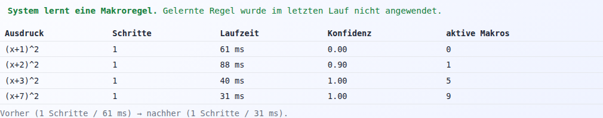

*Der Screenshot zeigt die Lern-Zusammenfassung: nach einigen Beispielen
wird eine wiederkehrende Umformungsfolge als Makroregel aktiviert und
beim nächsten Lauf direkt verwendet.*

- **Eingabe** — mehrere binomische Ausdrücke unterschiedlicher Form.
- **Ergebnis** — Eine Makroregel wird aktiviert und beim nächsten
  Lauf direkt eingesetzt.
- **Rechenweg** — Pro Beispiel der reguläre Suchpfad; ab dem aktivierten
  Lauf wird die gelernte Makroregel als Abkürzung verwendet.
- **Verwendete Regeln** — die gelernte Makroregel
  (für diese Demo aktiviert).
- **Annahmen** — keine.
- **Proof-Status** — an Beispielen validiert; eine optionale formale
  Prüfung ist im Proof-Job-Panel möglich.

### Warum ist das interessant?

Das System erkennt eine wiederkehrende Umformungsfolge und nutzt sie
später als Abkürzung. So wird die Suche mit der Zeit schneller, ohne
dass jemand händisch neue Regeln programmiert.

> Eine Makroregel wurde aus mehreren Beispielen gelernt.

| Aspekt | Wert |
| --- | --- |
| Demo-ID | `macro-learning` |
| Test | `macroLearningBrowserFlow()` |

---

## Trigonometrische Identität

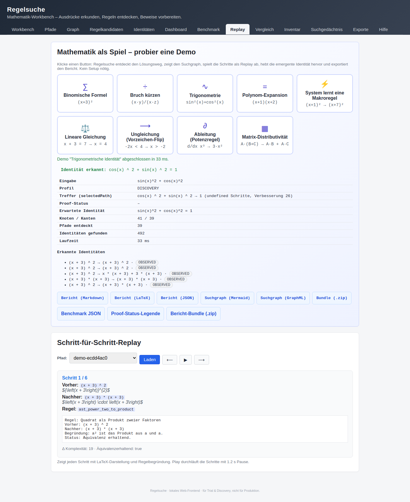

*Der Screenshot zeigt den auf den besten Rechenweg gefilterten Graphen,
der die Pythagoras-Identität als Pfad findet.*

**Eingabe** — Anzeigeform:

$$
\sin(x)^2 + \cos(x)^2
$$

Technische Eingabe:

```text
sin(x)^2 + cos(x)^2
```
**Ergebnis** — Anzeigeform:

$$
\sin(x)^2 + \cos(x)^2 \rightarrow 1
$$
- **Rechenweg** — Anwenden der Pythagoras-Identität.
- **Verwendete Regeln** — trigonometrische Pythagoras-Identität.
- **Annahmen** — keine.
- **Proof-Status** — symbolisch geprüft.

### Warum ist das interessant?

Eine berühmte Identität fällt nicht „vom Himmel“, sondern wird als
echter Pfad im Suchraum gefunden.

| Aspekt | Wert |
| --- | --- |
| Demo-ID | `trigonometry` |
| Test | `trigonometryDemoBrowserFlow()` |

---

## Polynom-Expansion

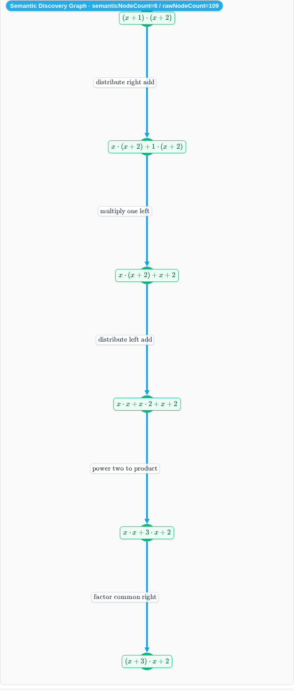

*Der Screenshot zeigt im gefilterten Best-Pfad-Graphen, wie das Produkt
zweier Linearfaktoren über Distributivgesetz und Zusammenfassen zum
Polynom expandiert wird.*

**Eingabe** — Anzeigeform:

$$
(x + 1)(x + 2)
$$

Technische Eingabe:

```text
(x+1)*(x+2)
```
**Ergebnis** — Anzeigeform:

$$
(x + 1)(x + 2) \rightarrow x^2 + 3x + 2
$$
- **Verwendete Regeln** — Distributivgesetz, Zusammenfassen.
- **Annahmen** — keine.
- **Proof-Status** — symbolisch geprüft.

### Warum ist das interessant?

Zeigt denselben Mechanismus wie die binomische Formel auf einem
allgemeineren Beispiel — ein guter Vergleichspunkt.

| Aspekt | Wert |
| --- | --- |
| Demo-ID | `polynomial-expansion` |
| Test | `polynomialExpansionBrowserFlow()` |

---

## Lineare Gleichung

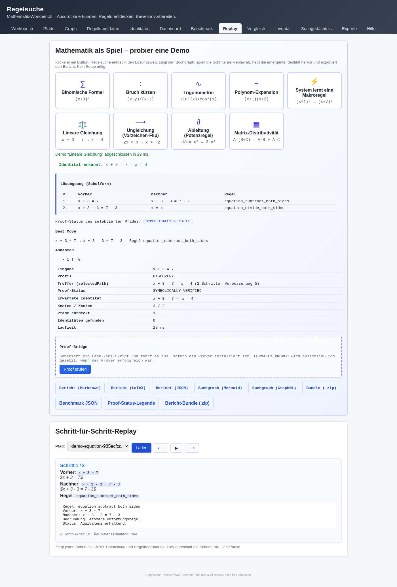

*Der Screenshot zeigt die Demo-Summary mit dem Schulform-Lösungsweg
einer linearen Gleichung.*

**Eingabe** — Anzeigeform:

$$
x + 3 = 7
$$

Technische Eingabe:

```text
x + 3 = 7
```
**Ergebnis** — Anzeigeform:

$$
x + 3 = 7 \rightarrow x = 4
$$
- **Verwendete Regeln** — Äquivalenzumformung (Subtraktion auf beiden
  Seiten).
- **Annahmen** — keine.
- **Proof-Status** — symbolisch geprüft.

### Warum ist das interessant?

Der Schulform-Lösungsweg wird Schritt für Schritt erzeugt — genau so,
wie er an der Tafel aussehen würde.

| Aspekt | Wert |
| --- | --- |
| Demo-ID | `math-equation` |
| Test | `mathEquationBrowserFlow()` |

---

## Ableitung (Regelkarte)

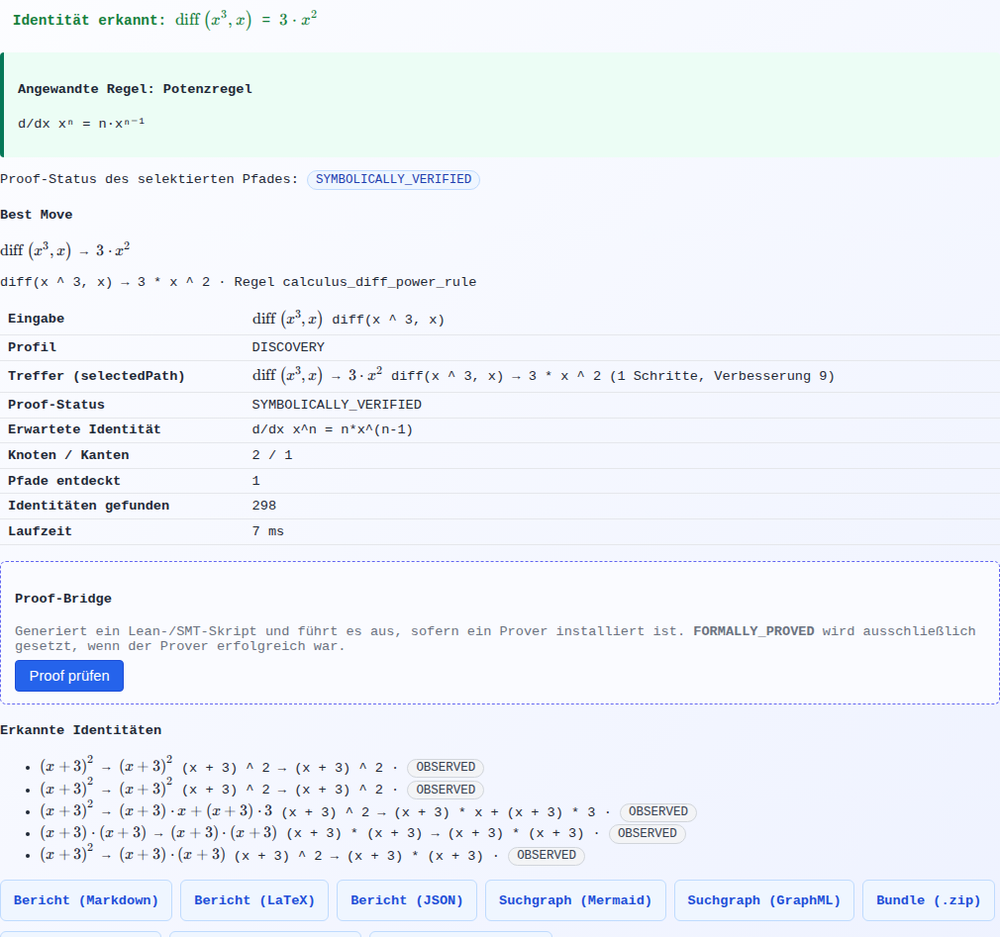

*Der Screenshot zeigt die Regelkarte, die die Anwendung der Potenzregel
erklärt.*

**Eingabe** — Anzeigeform:

$$
\frac{d}{dx} x^3
$$

Technische Eingabe:

```text
d/dx x^3
```
**Ergebnis** — Anzeigeform:

$$
\frac{d}{dx} x^3 \rightarrow 3x^2
$$
- **Verwendete Regeln** — Potenzregel der Differentialrechnung.
- **Annahmen** — keine.
- **Proof-Status** — symbolisch geprüft.

### Warum ist das interessant?

Die Regelkarte benennt den Schritt — nicht nur das Ergebnis, sondern
auch *welche* Ableitungsregel angewendet wurde.

| Aspekt | Wert |
| --- | --- |
| Demo-ID | `math-derivative` |
| Test | `mathDerivativeBrowserFlow()` |

---

## Matrix-Distributivität

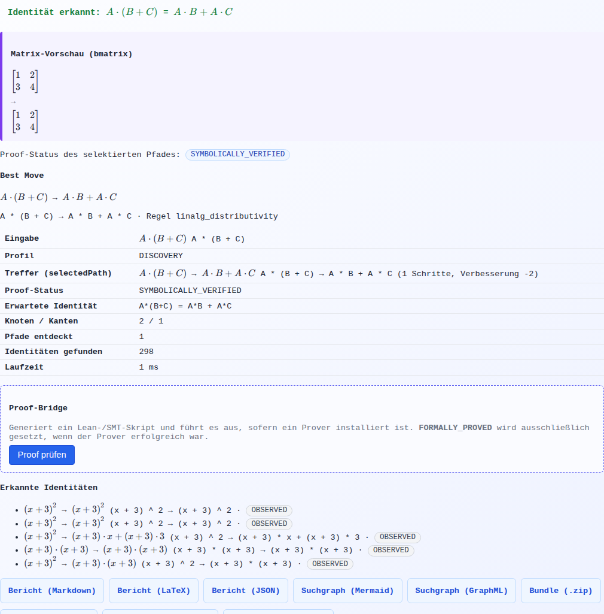

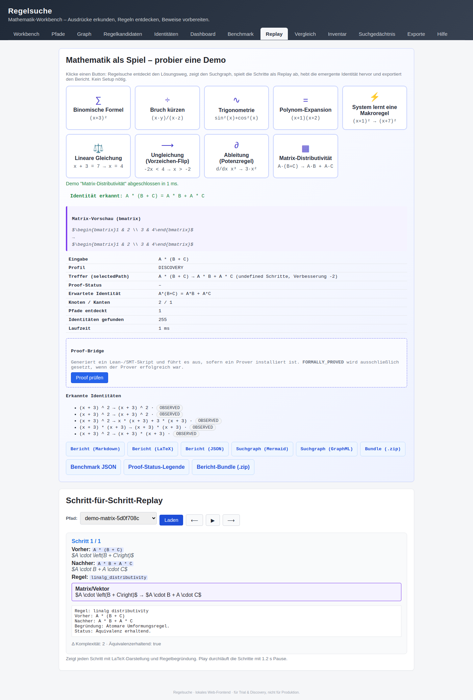

*Der erste Screenshot zeigt eine echte `bmatrix`-Vorschau; der zweite
zeigt die Replay-Karte für die Anwendung der Matrixdistributivität.*

**Eingabe** — Anzeigeform:

$$
A(B + C)
$$

mit konkreten Matrizen z. B.

$$
A = \begin{bmatrix} 1 & 2 \\ 3 & 4 \end{bmatrix}
$$

Technische Eingabe:

```text
A*(B + C)
```
**Ergebnis** — Anzeigeform:

$$
A(B + C) \rightarrow AB + AC
$$
- **Verwendete Regeln** — Distributivität der Matrixmultiplikation.
- **Annahmen** — passende Dimensionen.
- **Proof-Status** — symbolisch geprüft.

### Warum ist das interessant?

Auch in der linearen Algebra wird der Rechenweg als Pfad sichtbar —
inklusive einer echten mathematischen Vorschau.

| Aspekt | Wert |
| --- | --- |
| Demo-ID | `math-matrix` |
| Test | `mathMatrixBrowserFlow()` |

---

## Proof-Bridge

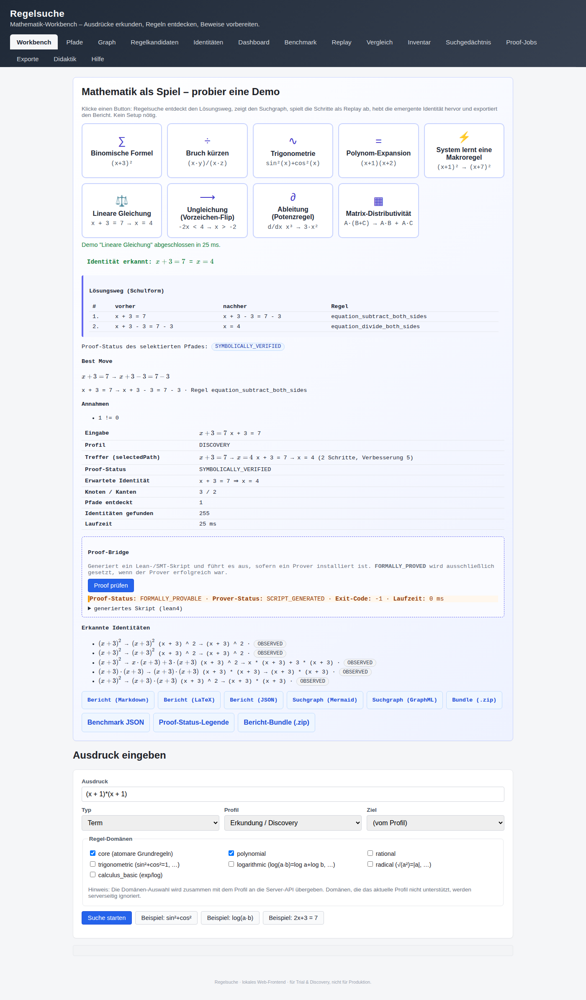

*Der Screenshot zeigt die Ergebnisbox der Proof-Bridge mit dem
generierten Lean/SMT-Skript.*

- **Eingabe** — der zuvor gefundene Rechenweg einer Math-Demo.
- **Ergebnis** — ein generiertes Lean/SMT-Skript, das den Pfad als
  formalen Beweis ausdrückt.
- **Verwendete Regeln** — die Regeln des betrachteten Rechenwegs.
- **Annahmen** — die im Pfad sichtbar gemachten Annahmen.
- **Proof-Status** — `FORMALLY_PROVED` wird **nur** gesetzt, wenn ein
  echter Prover (Lean/SMT) den Beweis bestätigt.

### Warum ist das interessant?

Eine gefundene Regel kann zusätzlich formal geprüft werden — der
gleiche Pfad wird damit von „algebraisch plausibel“ zu „durch einen
Beweiser bestätigt“.

> **Echter Prover vs. E2E-Test-Prover:** In der Produktion wird ein
> echter Prover wie Lean oder ein SMT-Solver verwendet. In der
> E2E-Testumgebung läuft stattdessen ein deterministischer
> Test-Prover, damit die Tests reproduzierbar bleiben. Der
> Status `FORMALLY_PROVED` wird im Test-Modus nicht gesetzt.

| Aspekt | Wert |
| --- | --- |
| Endpoint | `POST /api/proof-bridge` |
| UI | Button **Proof prüfen** im Demo-Summary jeder Math-Domain-Demo |
| Test | `proofBridgePanelShowsGeneratedScript()` |

---

## Proof-Job-Panel — `a + 0 → a`


*Der Screenshot zeigt das Proof-Job-Panel mit Statusübersicht und den
Links zu den erzeugten Artefakten.*

**Eingabe** — Anzeigeform:

$$
a + 0 \rightarrow a
$$

Technische Eingabe im Panel:
Felder „Left = `a + 0`“, „Right = `a`“.
- **Ergebnis** — ein abgeschlossener Job mit Artefakt-Bundle.
- **Verwendete Regeln** — die zu beweisende Identität selbst.
- **Annahmen** — keine.
- **Proof-Status** — abhängig vom verwendeten Prover (siehe Hinweis
  unten).
- **Export** — Artefakte unter
  `$REGELSUCHE_PROOF_ARTIFACT_PATH/<jobId>/`
  (`proof.lean`, `proof.smt2`, `metadata.json`, `stdout.txt`,
  `stderr.txt`).

### Warum ist das interessant?

Zeigt die persistente Job-Pipeline: Job einreichen → Status pollen
→ Artefakt-Bundle abholen. Damit lassen sich Beweise asynchron im
Hintergrund laufen lassen.

> **Echter Prover vs. E2E-Test-Prover:** Der Screenshot stammt aus
> dem E2E-Test. Dort wird ein deterministischer Test-Prover
> verwendet, damit der Job zuverlässig durchläuft, auch ohne Z3
> oder Lean. Im echten Proof-Modus wird `FORMALLY_PROVED` **nur**
> gesetzt, wenn Lean bzw. ein SMT-Solver den Beweis tatsächlich
> bestätigt.

| Aspekt | Wert |
| --- | --- |
| Tab | **Proof-Jobs** |
| Flow | Job einreichen → Statuspolling → Artefaktbundle |
| Test | `ProofJobPanelBrowserFlowTest#proofJobPanelBrowserFlow` |

---

## Export-Bundle

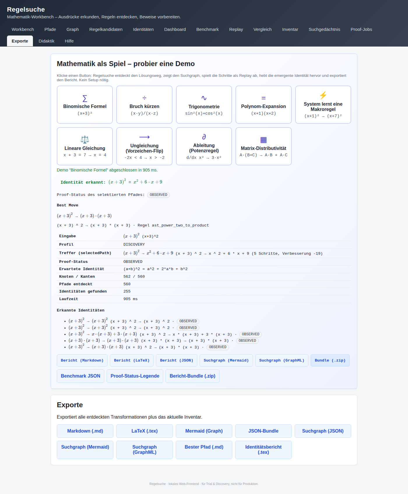

*Der Screenshot zeigt die Übersicht der Dateien, die im Export-Bundle
enthalten sind.*

Das Export-Bundle macht den Rechenweg **außerhalb der App nutzbar**:

- **Markdown** — für Dokumentation, Tickets, Lehrmaterial.
- **LaTeX** — für mathematische Texte, Skripte und Klausuren.
- **JSON** — für maschinelle Weiterverarbeitung in eigenen Tools.
- **Mermaid / GraphML** — für Graph-Visualisierung in anderen
  Werkzeugen.
- **Rule-Inventory** — die gefundenen und gelernten Regeln zur
  Wiederverwendung in späteren Suchen.

### Warum ist das interessant?

Ein einzelner Klick erzeugt einen kompletten Berichtsbund, der sich
in Dokumentation, Vorlesung oder weiteren Werkzeugen direkt
weiternutzen lässt.

| Aspekt | Wert |
| --- | --- |
| Endpoint | `GET /api/exports/bundle.zip` |
| Test | `exportBundleDownloads()` |
