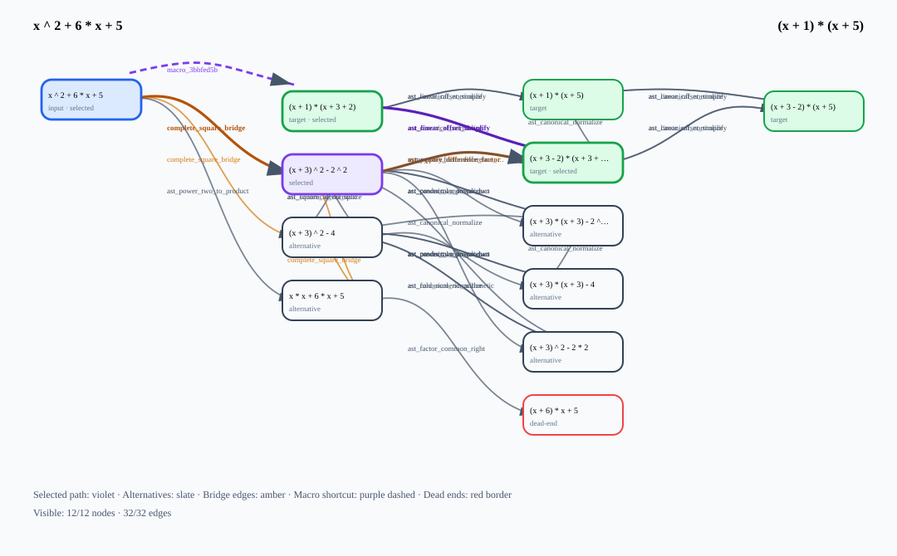
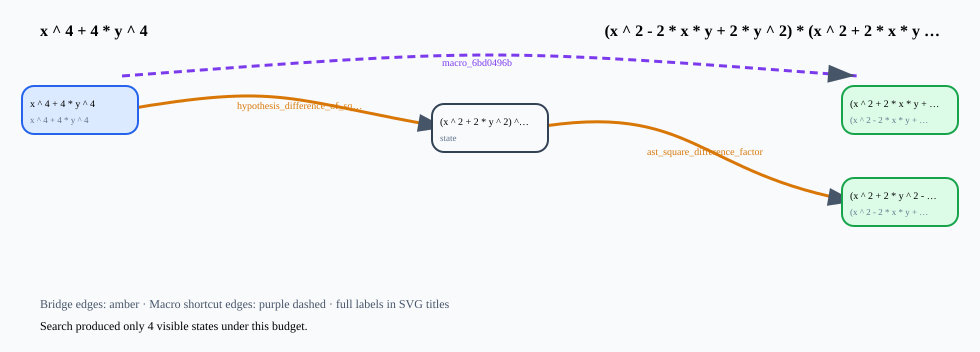

# Regelsuche Discovery Gallery

This gallery contains generated evidence only.

## Complete-square factorization

- Input: `x ^ 2 + 6 * x + 5`
- Target: `(x + 1) * (x + 5)`
- Evidence status: success
- Bridge used: `complete_square_bridge`, `ast_square_difference_factor`
- Macro learned: `macro_3bbfed5b`
- Macro reused: `macro_3bbfed5b`
- Search-space excerpt: [SVG](generated/discovery/complete-square/search-space.svg)
- Evidence JSON link: [evidence.json](generated/discovery/complete-square/evidence.json)

## Sophie-Germain discovery

- Input: `x ^ 4 + 4 * y ^ 4`
- Target: `(x ^ 2 - 2 * x * y + 2 * y ^ 2) * (x ^ 2 + 2 * x * y + 2 * y ^ 2)`
- Evidence status: success
- Hidden bridge used: `hypothesis_difference_of_squares_preparation`, `ast_square_difference_factor`
- Macro learned: `macro_6bd0496b`
- Macro reused: `macro_6bd0496b`
- Search-space excerpt: [SVG](generated/discovery/sophie-germain/search-space.svg)
- Evidence JSON link: [evidence.json](generated/discovery/sophie-germain/evidence.json)

## Scenario comparison

| Scenario | Success | States | Edges | Bridge rules | Learned macros | Reused macros |
|---|---:|---:|---:|---:|---:|---:|
| Complete-square factorization | yes | 13 | 30 | 2 | 1 | 1 |
| Sophie-Germain hidden structure | yes | 56 | 113 | 2 | 1 | 1 |

