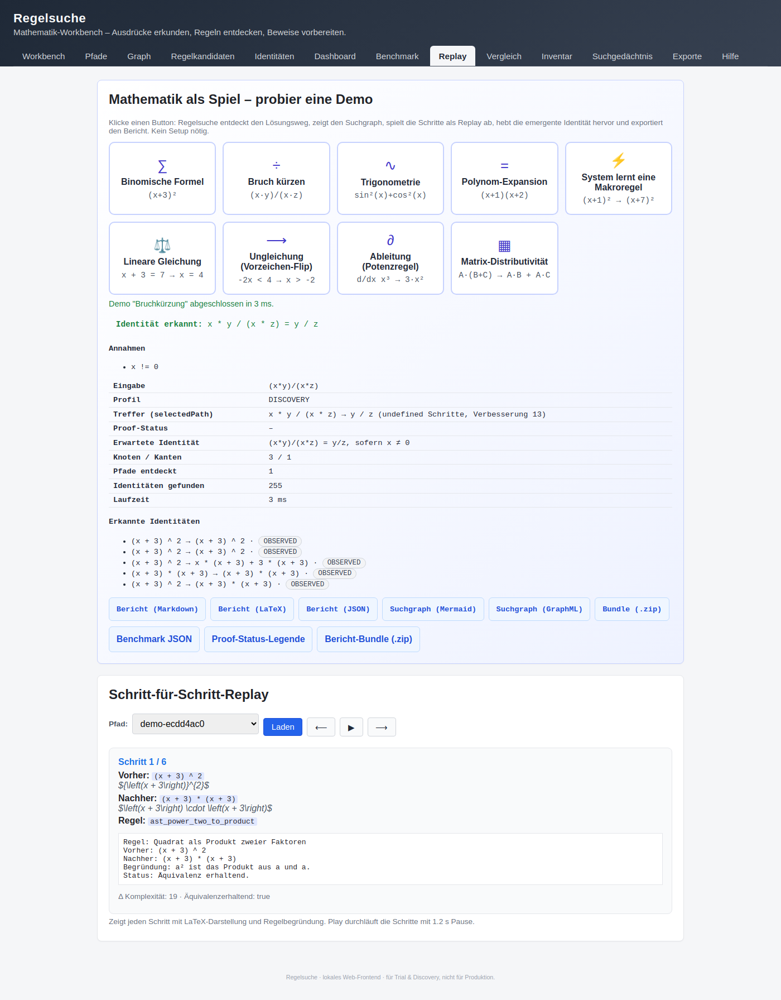

# Demo-Gallery

Jede Demo unten wird von einem **echten Playwright-Browsertest** abgenommen, der
denselben Screenshot erzeugt. So bleibt die Doku immer aktuell — wenn die
Funktion bricht, fällt der Screenshot weg, weil der Test rot wird.

Aktualisieren der Gallery:

```bash
./gradlew e2eTest -Pregelsuche.recordDocs=true
```

Die Tests stehen in
[`app/src/e2eTest/java/de/regelsuche/e2e/BrowserDemoFlowTest.java`](../app/src/e2eTest/java/de/regelsuche/e2e/BrowserDemoFlowTest.java).

---

## Binomische Formel — `(x+3)² → 9 + 6·x + x²`


| Aspekt | Wert |
| --- | --- |
| Demo-ID | `binomial` |
| Erwarteter Rechenweg | `(x+3)^2 → x*(x+3)+3*(x+3) → x^2+3x+3x+9 → x^2+6x+9` |
| Test | `binomialDemoBrowserFlow()` |
| Export | `GET /api/exports/bundle.zip` nach Demo-Klick |

## Bruchkürzung mit Annahme `x ≠ 0`



| Aspekt | Wert |
| --- | --- |
| Demo-ID | `rational` |
| Erwarteter Rechenweg | `(x·y)/(x·z) → y/z`, sofern `x ≠ 0` |
| Test | `rationalDemoBrowserFlow()` |
| Hinweis | Die Annahme `x ≠ 0` wird explizit im Summary-Panel ausgewiesen. |

## Trigonometrische Identität


| Aspekt | Wert |
| --- | --- |
| Demo-ID | `trigonometry` |
| Erwarteter Rechenweg | `sin(x)^2 + cos(x)^2 → 1` (Pythagoras) |
| Test | `trigonometryDemoBrowserFlow()` |

## Polynom-Expansion


| Aspekt | Wert |
| --- | --- |
| Demo-ID | `polynomial-expansion` |
| Erwarteter Rechenweg | `(x+1)·(x+2) → x² + 3·x + 2` |
| Test | `polynomialExpansionBrowserFlow()` |

## Macro-Learning


| Aspekt | Wert |
| --- | --- |
| Demo-ID | `macro-learning` |
| Beobachtung | Nach drei Beispielen aktiviert `MacroRuleLearningService` die binomische Formel als Makroregel; der vierte Lauf nutzt sie. |
| Test | `macroLearningBrowserFlow()` |

## Math-Domain: Lineare Gleichung


| Aspekt | Wert |
| --- | --- |
| Demo-ID | `math-equation` |
| Erwarteter Rechenweg | `x + 3 = 7  → x = 4` (Schulform-Lösungsweg) |
| Test | `mathEquationBrowserFlow()` |

## Math-Domain: Ungleichung mit Vergleichszeichen-Flip


| Aspekt | Wert |
| --- | --- |
| Demo-ID | `math-inequality` |
| Erwarteter Rechenweg | `-2·x < 4  → x > -2` mit explizitem Vorzeichen-Flip |
| Test | `inequalityReplayShowsFlipWarning()` |
| Besonderheit | Die Replay-Karte des kippenden Schritts trägt die CSS-Klasse `replay-flip-notice` und zeigt einen roten Hinweis. |

## Math-Domain: Ableitung (Regelkarte)


| Aspekt | Wert |
| --- | --- |
| Demo-ID | `math-derivative` |
| Erwarteter Rechenweg | `d/dx x³ → 3·x²` (Potenzregel) |
| Test | `mathDerivativeBrowserFlow()` |

## Math-Domain: Matrix-Distributivität


| Aspekt | Wert |
| --- | --- |
| Demo-ID | `math-matrix` |
| Erwarteter Rechenweg | `A·(B + C)  →  A·B + A·C` |
| Test | `mathMatrixBrowserFlow()` |
| Besonderheit | Die Replay-Karte rendert eine echte `\begin{bmatrix}`-Vorschau. |

## Proof-Bridge


| Aspekt | Wert |
| --- | --- |
| Endpoint | `POST /api/proof-bridge` |
| UI | Button **Proof prüfen** im Demo-Summary jeder Math-Domain-Demo |
| Test | `proofBridgePanelShowsGeneratedScript()` |
| Status | `FORMALLY_PROVED` wird **nur** gesetzt, wenn der Prover (Lean/SMT) den Beweis bestätigt. |

## Export-Bundle


| Aspekt | Wert |
| --- | --- |
| Endpoint | `GET /api/exports/bundle.zip` |
| Inhalt | Markdown-Bericht, LaTeX, JSON, Mermaid, GraphML, Rule-Inventory |
| Test | `exportBundleDownloads()` |
