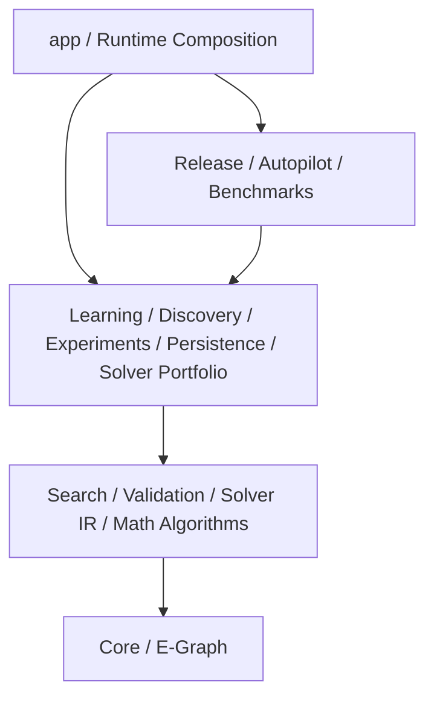

# Modulstruktur

Regelsuche ist ein Gradle-Multi-Projekt. Fachliche Verantwortungen werden in
eigenständigen Modulen gehalten; `app` bleibt die äußere Composition Root für
Web, konkrete CLI, Bootstrap und technische Adapter.

`settings.gradle` und die jeweiligen `build.gradle`-Dateien sind die
maßgebliche technische Quelle. Diese Seite erklärt die beabsichtigte
Verantwortung und darf keine abweichende zweite Dependency-Definition erzeugen.

## Modulübersicht

| Gradle-Projekt | Verantwortung | Typische direkte Grundlagen |
| --- | --- | --- |
| `:regelsuche-core` | AST, Parser, kanonische Identität, Annahmen und atomare Transformationen | keine Projektabhängigkeit |
| `:regelsuche-egraph` | E-Graph, Equality Saturation und E-Matching | Core |
| `:regelsuche-search` | Suchprobleme, Strategien, Budgets, Scoring und Search Memory | Core, E-Graph |
| `:regelsuche-validation` | Äquivalenz-, Validation- und Counterexample-Verträge | Core |
| `:regelsuche-math-algorithms` | reine mathematische Algorithmen und interne Referenzverfahren | Core, Validation |
| `:regelsuche-math-jas` | optional isolierte JAS-nahe Adapter | Validation |
| `:regelsuche-solver-ir` | solver-neutrale Obligationen, Übersetzungen, Ergebnisse und Executions | Core, Search, Validation, Math Algorithms |
| `:regelsuche-solver-portfolio` | capability-aware Backend-Auswahl, Budgets, Cache und Konflikte | Solver IR |
| `:regelsuche-learning` | Mining, Anti-Unification, Kandidaten und Rewrite-Program-Lernen | Core, Search, Validation, Solver IR |
| `:regelsuche-discovery` | domänenneutrale Discovery-Typen, Profile und Lifecycle-Handoff | Core, Search, Validation |
| `:regelsuche-experiments` | Experiment-, Corpus-, Budget- und Evidence-DAG-Verträge | Search, Validation, Discovery, Math Algorithms |
| `:regelsuche-benchmarks` | track-spezifische Vergleiche und Informationsparität | Search, Solver IR, Solver Portfolio |
| `:regelsuche-persistence` | technologiearme Persistenzports, Konfiguration und Checkpoints | Core |
| `:regelsuche-persistence-hibernate` | PostgreSQL, Hibernate ORM/Search, Migrationen und relationale Repositories | Persistence und benötigte Fachmodule |
| `:regelsuche-autopilot` | Composition von Experiment-, Learning- und Campaign-Verträgen | Experiments, Learning |
| `:regelsuche-release` | Qualification, Evidence Profiles, Utility und Reproduktionsartefakte | explizite obere Fachmodule |
| `:regelsuche-cli` | projektunabhängige CLI-Primitiven und Optionsverarbeitung | keine Projektabhängigkeit |
| `:app` | Composition Root, Web-Workbench, konkrete CLI, Docker-/Runtime-Wiring | produktive Fachmodule und Adapter |
| `:ai-knowledge-verification` | optionaler Consumer-Vertrag des externen AI-Knowledge-Extractors | nur bei expliziter Aktivierung |

## Schichten

Die Darstellung zeigt Verantwortungsebenen, nicht jede einzelne direkte
Gradle-Kante. Verbindliche Richtungen stehen in
[Dependency-Regeln](dependency-rules.md).

## Mathematischer Kern

`:regelsuche-core` bildet die innerste Grenze. Es enthält keine
Datenbanktreiber, Webserver, Containerlogik oder externen Prozessadapter.

`:regelsuche-egraph`, `:regelsuche-search` und `:regelsuche-validation` bauen auf
dieser Grundlage auf, ohne die äußere Runtime zu kennen. Dadurch können
Suchsemantik und mathematische Regeln unabhängig von Web und Persistenz getestet
werden.

## Solver- und Benchmark-Grenze

`:regelsuche-solver-ir` definiert mathematische Problem- und Ergebnisverträge.
`:regelsuche-solver-portfolio` entscheidet über Backend-Ausführung, Budget und
Aggregation. Ein Portfolio-Report ist Ausführungsevidence; mathematische
Bestätigung bleibt an eine konkrete Solver Execution gebunden.

`:regelsuche-benchmarks` darf Suchstrategien und externe Backends unter einem
expliziten Parity-Vertrag verbinden. Es darf keine zweite Solver-IR und keinen
universellen Capability-Score einführen.

## Learning, Discovery und Experimente

- `:regelsuche-learning` enthält portable Candidate- und Programmlernlogik;
- `:regelsuche-discovery` enthält domänenneutrale Discovery- und Handoff-
  Verträge;
- `:regelsuche-experiments` beschreibt eingefrorene Inputs, Budgets, Runner und
  Evidence-DAGs;
- `:regelsuche-autopilot` komponiert diese Bausteine zu einer begrenzten
  Campaign, ohne die inneren Verträge umzudefinieren.

## Persistenzgrenze

`:regelsuche-persistence` enthält Ports und Konfiguration ohne Hibernate oder
Datenbanktreiber. Relationale Implementierung, Migration und Suchindex liegen
in `:regelsuche-persistence-hibernate`.

Datei-, Graph- und Webadapter, die nur für die konkrete Anwendung nötig sind,
dürfen in `app` verbleiben, bis eine stabile allgemeine Portgrenze vorhanden
ist.

## Composition Root

`app` darf Fachmodule verdrahten und konkrete Adapter auswählen. Es soll jedoch
keine neue mathematische Kernsemantik beherbergen, nur weil dort bereits alle
Abhängigkeiten verfügbar sind.

Neue Logik gehört in `app`, wenn sie tatsächlich eine der folgenden Rollen hat:

- HTTP- oder UI-Adapter;
- konkrete CLI-Komposition;
- Runtime-Konfiguration;
- Prozess- oder Infrastrukturadapter;
- Bootstrap und Lifecycle-Wiring.

## Noch nicht eigenständig modularisierte Bereiche

Web, einzelne Search-Index-, Provenienz-, CAS- und Dashboard-Anteile sind
teilweise noch in `app` oder bestehenden Adaptermodulen enthalten. Eine
physische Auslagerung ist erst sinnvoll, wenn:

1. die Verantwortung stabil benannt ist;
2. ein technologiearmer Port existiert;
3. keine Rückabhängigkeit in innere Module entsteht;
4. Tests die neue Grenze unabhängig charakterisieren;
5. der Nutzen die zusätzliche Modulkomplexität rechtfertigt.

Vorgesehene Modulnamen sind keine implementierte Capability und werden nicht
als Architekturstatus geführt.

## Regeln für neue Module

Ein neues Gradle-Modul benötigt:

- eine eindeutige fachliche Verantwortung;
- eine gerichtete, azyklische Dependency-Position;
- einen öffentlichen Port oder klar begrenzte API;
- unabhängige Tests;
- dokumentierte Auswirkungen auf Evidence und Versionierung;
- Aktualisierung von `settings.gradle`, dieser Seite und
  [Dependency-Regeln](dependency-rules.md).

Reine Verzeichnisorganisation oder die Umgehung eines bestehenden Zyklus ohne
fachliche Grenze ist kein ausreichender Grund für ein neues Modul.
