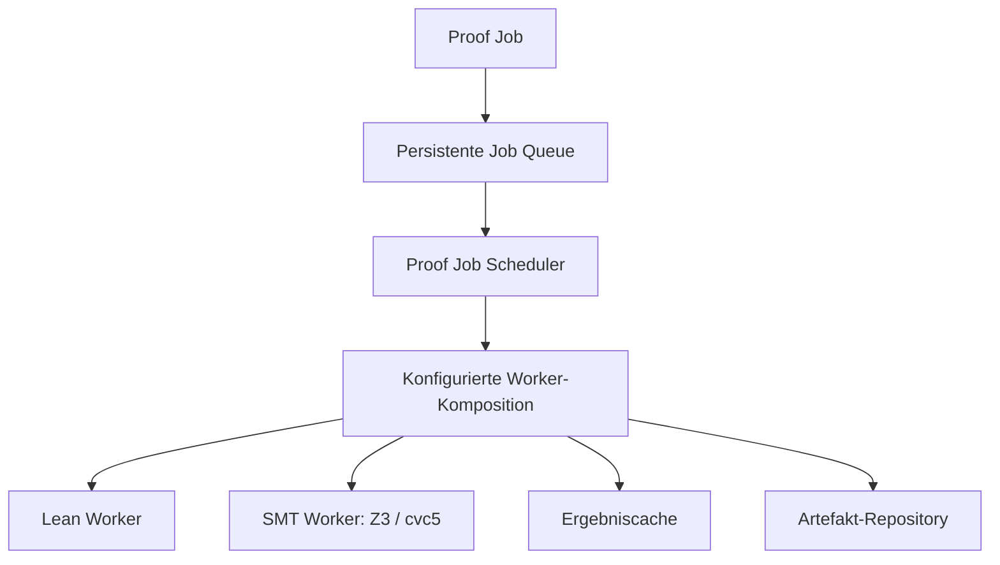

# Proof Workbench

Die Proof Workbench stellt unter **Proof-Jobs** eine persistente,
asynchrone Pipeline für Lean- und SMT-Obligationen bereit. Aufträge durchlaufen
Queue, Scheduler, Worker, Cache und Artefaktablage; mathematischer Status und
technischer Jobstatus bleiben getrennt.


*Der Screenshot wird aus dem Browser-E2E-Flow erzeugt und zeigt den Weg vom
Auftrag bis zum geöffneten Artefakt-Bundle.*

## Voraussetzungen

- Die Workbench wurde lokal gestartet.
- Die Proof-Funktion ist in der Serverkonfiguration aktiviert.
- Für reale formale Ergebnisse steht ein passender Solver beziehungsweise
  Prover zur Verfügung.

Die Standarddemo kann den Produktfluss mit einem deterministischen Testworker
zeigen. Dieser Flow belegt UI, Queue, Scheduler und Artefakte, aber keinen realen
mathematischen Proof. Reale Z3-/cvc5-Ausführung wird separat mit dem Proof-Image
geprüft.

## Bedienung

1. Führe zunächst eine Suche oder Demo aus, damit die weiterführenden Bereiche
   sichtbar werden.
2. Öffne **Proof-Jobs**.
3. Trage linke und rechte Seite der zu prüfenden Aussage ein.
4. Ergänze erforderliche Annahmen und bei Bedarf die Priorität.
5. Wähle **Job einreichen**.
6. Verfolge den Auftrag in der Jobliste. **Aktualisieren** lädt den neuesten
   Zustand; **Abbrechen** beendet einen noch nicht terminalen Auftrag.
7. Öffne bei einem terminalen Job **Artefakte** und prüfe Skript,
   Standardausgabe, Fehlerausgabe und Metadaten getrennt.

Die Oberfläche unterscheidet mindestens:

- wartend;
- laufend;
- bestätigt;
- fachlich nicht bestätigt oder widerlegt;
- technisch fehlgeschlagen;
- abgebrochen;
- Proof-Funktion nicht verfügbar.

Eine deaktivierte Funktion erscheint als nicht verfügbar und nicht als rohe
Serverfehlermeldung.

Der vollständige HTTP-Vertrag steht in der lokalen Swagger UI unter dem Bereich
**Proof Jobs**. Markdown dupliziert Methoden, Pfade, Payloads und Statuscodes
nicht.

## Dokumentierter Browserflow

Der sichtbare End-to-End-Flow verwendet die Sophie-Germain-Identität:

```text
a^4 + 4*b^4
→ (a^2 - 2*a*b + 2*b^2) * (a^2 + 2*a*b + 2*b^2)
```

Die SMT-Bridge expandiert begrenzte nichtnegative ganzzahlige Exponenten in
gewöhnliche nichtlineare reelle Arithmetik. Andere Exponenten verwenden einen
explizit deklarierten `pow`-Fallback. Dadurch ist die sichtbare `a^4`-Notation
Teil einer strukturierten Obligation und nicht nur Darstellung.

Der Browser-Test reicht den Auftrag ein, wartet auf die Jobliste, öffnet das
Bundle und erzeugt den Screenshot. Aktualisierung:

```bash
./gradlew :app:e2eTest -Pregelsuche.recordDocs=true
```

Dokumentationsaufnahme und mathematische Solverbestätigung sind getrennte
Verträge.

## Ausführungsarchitektur



Queue, Cache und Artefakte verwenden atomare Dateischreibvorgänge. Der aktive
Worker wird von der Anwendung konfiguriert und nicht durch frei wählbare
Auftragsdaten ersetzt. Ein Aufrufer kann die Proof-Grenze deshalb nicht
unbemerkt auf ein permissiveres Backend umschalten.

## Konfiguration

| Umgebungsvariable | Standard | Zweck |
| --- | --- | --- |
| `REGELSUCHE_PROOF_ENABLED` | `true` | aktiviert Scheduler, UI und Proof-Operationen |
| `REGELSUCHE_PROOF_ARTIFACT_PATH` | `<persistencePath>/proofs` | Wurzel der auftragsspezifischen Bundles |
| `REGELSUCHE_PROOF_JOB_STORE` | `<persistencePath>/proof-jobs.json` | persistente Queue |
| `REGELSUCHE_PROOF_CACHE` | `<persistencePath>/proof-cache.json` | Cache für wiederholte Obligationen |

Explizite JVM-Properties können in Tests und kontrollierten Starts Vorrang vor
Umgebungsvariablen besitzen. Die genaue REST-Konfiguration ist in OpenAPI
dokumentiert.

## Artefakt-Bundle

Jeder terminale Übergang schreibt ein einheitliches Bundle, auch bei Fehlern:

```text
proofs/
└── <jobId>/
    ├── proof.lean      # alternativ proof.smt2 oder proof.txt
    ├── stdout.txt
    ├── stderr.txt
    └── metadata.json
```

`metadata.json` bindet Auftrag, Worker, Tool, Status und diagnostische
Ausführungsdaten. Pfad-Traversal und unzulässiger Dateizugriff werden durch
Repositorytests blockiert.

Eine vorhandene Proof-Datei autorisiert noch keinen formalen Status. Erst das
strukturierte, tatsächlich ausgeführte Backend-Ergebnis darf einen
entsprechenden Claim tragen.

## Proof-Image mit realen Solvern

`Dockerfile.proof` enthält Z3 und cvc5:

```bash
docker build -f Dockerfile.proof -t regelsuche-proof .
docker run --rm -p 127.0.0.1:8080:8080 regelsuche-proof
```

Lean 4 kann optional ergänzt werden:

```bash
docker build \
  -f Dockerfile.proof \
  --build-arg INSTALL_LEAN=true \
  -t regelsuche-proof-lean .
```

Das Proof-Image ist eine lokale Referenzumgebung. Eine öffentliche
Bereitstellung benötigt dieselben Authentifizierungs-, TLS- und
Ressourcengrenzen wie die normale Workbench.

## Verifikation

Realer Image- und Solververtrag:

```bash
./gradlew :app:dockerE2eTest \
  --tests de.regelsuche.dockere2e.ProofDockerImageIntegrationTest
```

Der Test baut das reale Image über Testcontainers, prüft die installierten
Solver, reicht die Sophie-Germain-Obligation über die Anwendung ein, wartet auf
den terminalen Status und verifiziert das vollständige Bundle.

Repositoryweiter autoritativer Vertrag:

```bash
./gradlew --no-configuration-cache ciCheck
```

Die Verifikationssemantik liegt in Gradle, JUnit und den Checkout-Skripten, nicht
in einem GitHub-spezifischen Proof-Workflow.

## Wichtige Testbereiche

- technischer Job-Lebenszyklus und Fehlerstatus;
- persistente Queue und Neustartverhalten;
- Bundle-Layout und Traversal-Schutz;
- Konfigurationspriorität;
- SMT-Translation, Potenzexpansion und Fallback;
- Browserflow mit Jobliste und Artefaktansicht;
- reale Z3-/cvc5-Ausführung im Proof-Image.

## Aussagegrenzen

Die Proof Workbench belegt je nach ausgeführtem Vertrag:

- reproduzierbare Bildung einer Obligation;
- technische Ausführung eines Backends;
- retained Solver-Ausgabe und Artefakte;
- gegebenenfalls einen bestätigten formalen Status.

Sie belegt nicht automatisch:

- externe mathematische Neuheit;
- Interessantheit;
- Vollständigkeit des gewählten Formalisierungsfragments;
- Fehlerfreiheit des Provers;
- allgemeine Beweisbarkeit außerhalb der konkreten Obligation.

## Siehe auch

- [Proof Bridge](proof-bridge.md)
- [Solver-neutrale IR](solver-neutral-ir.md)
- [Solver-Portfolio](solver-portfolio.md)
- [Web-Workbench](web-workbench.md)
- [Testing und Verifikation](testing.md)
