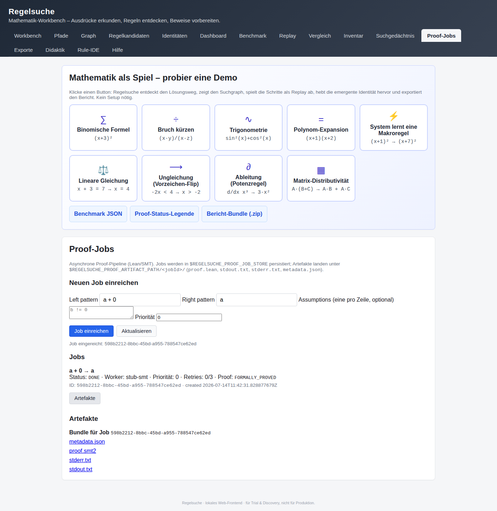
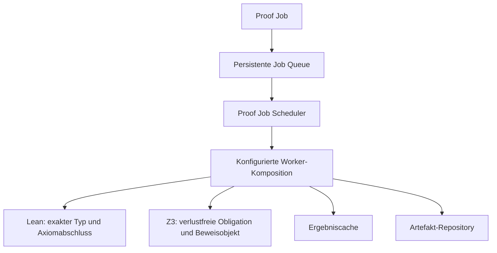

# Proof Workbench

Die Proof Workbench stellt unter **Proof-Jobs** eine persistente,
asynchrone Pipeline für Lean- und SMT-Obligationen bereit. Aufträge durchlaufen
Queue, Scheduler, Worker, Cache und Artefaktablage; mathematischer Status und
technischer Jobstatus bleiben getrennt.



*Der Screenshot dokumentiert den Browserflow, nicht die Bestätigung eines neuen
Lean-Beweises. Reale Werkzeugprüfung und UI-Aufnahme sind getrennte Abnahmen.*

## Voraussetzungen

Die Workbench muss laufen und die Proof-Funktion in der Serverkonfiguration
aktiviert sein. Ein deterministischer Testworker kann UI, Queue und Artefakte
prüfen, liefert aber keinen realen mathematischen Nachweis.

Für reale Bestätigung verwendet die Anwendung die
[geprüften Proof Bridges](proof-bridge.md). Lean benötigt ein vorbereitetes,
festgelegtes Lean/mathlib-Projekt einschließlich `lean-toolchain` und
`lake-manifest.json`, nicht lediglich ein installiertes Programm. Z3 muss
verfügbar sein und ein vollständiges Beweisobjekt liefern. Ein erfolgreicher
beliebiger Prozess ist nur `PROCESS_SUCCEEDED` und autorisiert kein
`FORMALLY_PROVED`.

## Bedienung

1. Führe zunächst eine Suche oder Demo aus, damit die weiterführenden Bereiche
   sichtbar werden.
2. Öffne **Proof-Jobs**.
3. Trage linke und rechte Seite der zu prüfenden Aussage ein.
4. Ergänze erforderliche Annahmen und bei Bedarf die Priorität.
5. Wähle **Job einreichen**.
6. Verfolge den Auftrag in der Jobliste. **Aktualisieren** lädt den neuesten
   Zustand; **Abbrechen** beendet einen noch nicht terminalen Auftrag.
7. Öffne bei einem terminalen Job **Artefakte** und prüfe Skript,
   Standardausgabe, Fehlerausgabe und Metadaten getrennt.

Eine deaktivierte Funktion erscheint als nicht verfügbar und nicht als rohe
Serverfehlermeldung. Der vollständige HTTP-Vertrag steht in der lokalen Swagger
UI unter **Proof Jobs**. Die typisierten Java-Bridges akzeptieren auch native
Ungleichheitsziele; das erweitert nicht automatisch jedes Browser-Eingabeformular.

## Dokumentierter Browserflow

Der vorhandene End-to-End-Flow verwendet die Sophie-Germain-Identität:

```text
a^4 + 4*b^4
→ (a^2 - 2*a*b + 2*b^2) * (a^2 + 2*a*b + 2*b^2)
```

Die SMT-Bridge nutzt jetzt denselben verlustfreien Renderer wie das
Solver-Portfolio. Unterstützte feste natürliche Potenzen behalten ihre
arithmetische Bedeutung. Nicht unterstützte Potenzen oder analytische Funktionen
werden abgelehnt; der frühere uninterpretiert deklarierte `pow`-Fallback ist
entfernt. Für unterstützte reelle Funktionsbeweise erzeugt die Lean-Bridge
wirkliche Taktiken mit `Real.exp`, `Real.log` und `Real.rpow`.

Der Browser-Test reicht den Auftrag ein, wartet auf die Jobliste, öffnet das
Bundle und erzeugt den Screenshot. Aktualisierung:

```bash
./gradlew :app:e2eTest -Pregelsuche.recordDocs=true
```

Eine solche Aufnahme ersetzt weder einen Solverlauf noch die Prüfung der
exakten Zielaussage und Annahmen.

## Ausführungsarchitektur


```mermaid
flowchart TD
    request[Proof Job] --> queue[Persistente Job Queue]
    queue --> scheduler[Proof Job Scheduler]
    scheduler --> workers[Konfigurierte Worker-Komposition]
    workers --> lean[Lean: exakter Typ und Axiomabschluss]
    workers --> smt[Z3: verlustfreie Obligation und Beweisobjekt]
    workers --> cache[Ergebniscache]
    workers --> artifacts[Artefakt-Repository]
```

Der aktive Worker ist vertrauenswürdige Anwendungskonfiguration, keine frei
wählbare Befehlszeile aus einem Auftrag. Die Standard-Bridges prüfen den
aktuellen Auftrag; ein älterer ungebundener Kandidatenstatus wird nicht als
neuer Beweis übernommen. Fremde Worker-Implementierungen sind weiterhin Teil
der vertrauenswürdigen Konfiguration.

## Konfiguration

| Umgebungsvariable | Standard | Zweck |
| --- | --- | --- |
| `REGELSUCHE_PROOF_ENABLED` | `true` | aktiviert Scheduler, UI und Proof-Operationen |
| `REGELSUCHE_PROOF_ARTIFACT_PATH` | `<persistencePath>/proofs` | Wurzel der auftragsspezifischen Bundles |
| `REGELSUCHE_PROOF_JOB_STORE` | `<persistencePath>/proof-jobs.json` | persistente Queue |
| `REGELSUCHE_PROOF_CACHE` | `<persistencePath>/proof-cache.json` | Cache für wiederholte Obligationen |
| `REGELSUCHE_LEAN_PROJECT` | nicht gesetzt | vorbereitetes, festgelegtes Lean/mathlib-Projekt |

`regelsuche.lean.project` kann das Lean-Projekt explizit festlegen.
`regelsuche.proof.evidence` beziehungsweise die typisierten Executor-Factories
legen den Ablageort der vollständigen Backend-Nachweise fest. Die genaue
REST-Konfiguration bleibt in OpenAPI dokumentiert.

## Artefakte und Vertrauensgrenze

Das Job-Bundle enthält Skript, stdout/stderr und Job-Metadaten. Der geprüfte
Backendlauf bewahrt zusätzlich die native Obligation, Übersetzung, Ergebnis und
Ausführung auf. Lean speichert `.lean`, `.olean`, Axiom-Audit, Werkzeugversion,
Konfiguration und ein hashgebundenes Zertifikat. Z3 speichert jeden vollständigen
SMT-Eingabetext, die tatsächlichen Ausgaben und das zugehörige Beweisobjekt.
Jeder neue Lauf erhält ein eigenes Verzeichnis.

Die Lean-Prüfung bindet einen geschlossenen Satz an genau die verlangte Aussage
und kontrolliert transitive Abhängigkeiten. Nur `propext`, `Classical.choice`
und `Quot.sound` sind in dieser Richtlinie zugelassen. Zusätzliche Axiome,
verstecktes `sorryAx`, geänderte Ziele oder zusätzliche Voraussetzungen werden
nicht akzeptiert. Das konfigurierte Lean/mathlib-System bleibt vertrauenswürdig
vorausgesetzt; beliebiger fremder Lean-Code ist kein zulässiger Auftrag.

Ein Beweis unter Annahmen beweist nicht deren gemeinsame Erfüllbarkeit. Die
SMT-Beweisobjekte werden gespeichert, aber hier nicht unabhängig im Lean-Kern
nachgeprüft. Der rohe cvc5-Executor ist nur Transport und kann ohne zusätzlichen
geprüften Adapter keinen formalen Status autorisieren.

## Proof-Image und tatsächliche Tests

`Dockerfile.proof` enthält Z3 und cvc5:

```bash
docker build -f Dockerfile.proof -t regelsuche-proof .
docker run --rm -p 127.0.0.1:8080:8080 regelsuche-proof
```

Die optionale Lean-Installation des Images allein ersetzt noch nicht das
benötigte vorbereitete mathlib-Projekt. Für dessen reproduzierbare Referenz
siehe `.ci/lean-proof` und [Proof Bridge](proof-bridge.md).

Der bestehende Testcontainers-Vertrag prüft die Image-Installation und den
Anwendungsflow:

```bash
./gradlew :app:dockerE2eTest \
  --tests de.regelsuche.dockere2e.ProofDockerImageIntegrationTest
```

Die neuen echten Backend- und App-Beweisläufe sind separat ausführbar:

```bash
export REGELSUCHE_REAL_LEAN=true
export REGELSUCHE_LEAN_PROJECT="$PWD/.ci/lean-proof"
(cd .ci/lean-proof && lake update && lake exe cache get)
mvn -B -pl app -am \
  -Dtest=CheckedLeanRealTest,CheckedProofBridgeRealTest \
  -Dsurefire.failIfNoSpecifiedTests=false test
```

Diese Tests benötigen Lean/mathlib und Z3. Ohne die ausdrückliche Umgebung sind
sie übersprungen, nicht bestanden. Ihre fokussierte Ausführung ersetzt nicht
die reguläre Gesamtsuite, Browser- oder Docker-Tests.

## Aussagegrenzen

Die Workbench organisiert reproduzierbare Beweisaufgaben, keine automatische
Begutachtung mathematischer Neuheit. Ein Skript ist noch kein Beweis, ein
Prozess-Erfolg noch keine mathematische Bestätigung. Die unterstützte
Repräsentation und der tatsächliche Backendlauf bestimmen die Aussagekraft.
Allgemeine Quantoren über Mengen, unendliche Summen und Grenzübergänge erfordern
weitere versionierte IR- und Beweisunterstützung, nicht undurchsichtige
Funktionsnamen oder stillschweigend weggelassene Voraussetzungen.

## Siehe auch

- [Proof Bridge](proof-bridge.md)
- [Solver-neutrale IR](solver-neutral-ir.md)
- [Solver-Portfolio](solver-portfolio.md)
- [Web-Workbench](web-workbench.md)
- [Testing und Verifikation](testing.md)

### Cache-Migration der Beweisgrenze

Die aktuelle Cache-Kennung bindet den Beweisvertrag und die Werkzeugkonfiguration,
nicht nur den Anzeigenamen des Workers. Alte Einträge bleiben erhalten, werden
aber nicht als neue Bestätigung übernommen. Auch unter einer aktuellen Kennung
ist ein gespeicherter `FORMALLY_PROVED`-Status kein wiederverwendbarer Beweis:
Dafür ist ein frischer Backendlauf erforderlich. Nichtformale Ergebnisse der
Skriptgenerierung bleiben innerhalb derselben Konfiguration wiederverwendbar.
Eine während der Ausführung geänderte Konfiguration verhindert die Freigabe.
